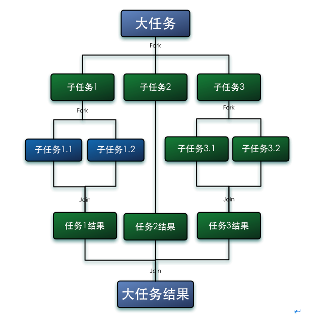
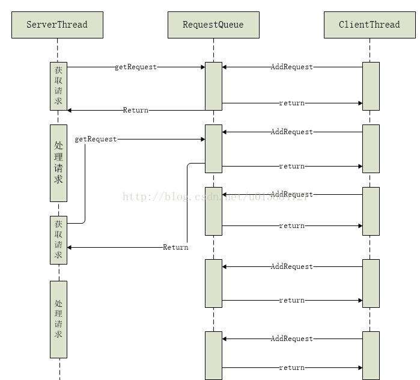

### 分工解决的问题
- 如何高效地拆解任务并分配给线程

### 分工部分的模式
#### 1. Executor与线程池 
- 5种不同线程池： 注意在实际使用过程中，无界队列导致的OOM问题
    - newCachedThreadPool： 
        - 无限制线程，创建新线程
        - 线程长时间空闲，会回收
        - 工作队列长度为0
    - newFixedThreadPool 
        - 固定线程数
        - 如果工作线程退出，会创建新线程
        - 无界的工作队列
    - newSingleThreadExecutor
        - 工作线程数为1
        - 无界的工作队列
    - newScheduledThreadPool
        - 与newSingleThreadExecutor类似
        - 区别是可以设置工作线程数
    - newWorkStealingPool 
        - 内部创建 ForkJoinPoint
        - 使用work stealing 算法
        
- ExecutorService 服务
    - Future submit(Callable task); 
    - 避免异常堆栈消失，可以
        1. 使用execute替换 submit
        2. 处理submit 返回结果Future.get
        3. 自定义线程池，在添加任务的时候保存异常栈信息
    - Future : 如果执行过程中抛出异常，get 方法会抛出执行异常
- Worker，内部静态类，基于AQS实现

- 线程池技巧
    - 避免任务堆积
    - 避免过多扩展线程
    - 警惕线程泄漏
    - 避免死锁
    - 避免使用线程池时，使用ThreadLocal
- 线程数选择
    - 目的： 
        - 降低延迟： 提升多核CPU利用率
        - 提高吞吐量
    - 优化方向： 将硬件性能发挥到极致，提升IO、CPU综合利用率
    - 探测需要使用多线程的场景：  CPU 和 I/O 设备的利用率都很低
    - 线程数计算方法
        - CPU密集型：线程数 = CPU数+1
        - IO密集型：最佳线程数 =CPU 核数 *（1 +（I/O 耗时 / CPU 耗时））
        - 等待较多：CPU核数*目标cpu利用率*（1+平均等待时间/平均工作时间）
    - 架构调整也能解决线程过多的问题
        - Reactive Stream
        
#### 2. Fork/Join
- ForkJoinPool 线程池
- 运行流程图
    
    
- 工作窃取算法： 指某个线程从其他线程的队列里窃取任务来执行
- ForkJoinTask
    - fork 将任务添加到队列
    - join 合并结果
    - complete 
    - 子类
        - RecursiveAction 无返回值
        - RecurisiveTask  有返回值            
            - fork                  开始执行任务
            - join                  等待任务执行结果
            - compute               实际业务处理流程,完成计算和任务分解逻辑
            - isCompletedAbnormally 执行过程中是否出现异常
            - getException          获取执行过程中的异常
<pre>
    class Task extends RecurisiveTask<T>{
        public T compute(){
            if(step < THREADHOLD){
                返回 直接计算结果
            }
            子任务集合 = 分解成多个任务
            for(子任务 ： 子任务集合）｛
                fork（子任务）
            ｝
            
            for(子任务 ： 子任务集合）｛
                子任务结果 = 子任务.join()
                结果 = 合并（结果，子任务结果）
            ｝
            返回 结果            
        }
    }
</pre> 

#### 3. Future
- Callable 拥有返回值的Runnable
    - ThreadPoolExecutor 执行Callable任务
    - <T> Future<T> submit(Callable<T> task) 执行Callable
    - 返回值Future
- Future
    - cancel               取消任务执行
    - isCancelled/isDone   任务执行状态判断
    - get                  阻塞，直到任务执行完成或抛出异常
    - get(timeout)         增加了超时功能
    - 实现类： FutureTask

#### 4. Guarded Suspension模式 保护性暂挂模式
- 涉及角色
    - 服务端线程
    - 客户端线程
    - 请求队列
    - 请求
- 运行流程
    - 客户端线程发起请求，服务端将请求放入请求队列
    - 服务端线程从请求队列获取请求，执行
    - 适合没有返回值的请求，否则使用Future模式更合适
 

#### 5. 生产者-消费者模式
- 涉及角色
    - 生产者    生产数据的线程
    - 消费者    消费数据的线程
    - 阻塞队列  存放待执行的任务，解耦生产者与消费者之间的强耦合
- 线程池实现
    - 生产者创建任务，直接丢到线程池
    - 线程池作为消费者，直接执行任务
    - 省了实现代码里的阻塞队列
    - 问题：线程池中队列大小设置
- 参考网址： http://ifeve.com/producers-and-consumers-mode/

#### 6. Thread-per-Message 模式
- 涉及角色
    - Client 发起请求
    - HOST   接收client请求，建立新线程处理请求
    - 实际处理者
- 流程
    -  Client 发起一个请求
    -  HOST 接收到请求，新建线程并将请求转发给实际处理者处理
- 特点：每个message（消息、命令、请求）都会分配一个线程来处理

#### 7. Worker Thread 模式
- 与Thread-Per-Message 模式类似
- 使用线程池，替换每次创建一个新线程

#### 8. 两阶段终止模式
- 准备阶段  
    - 主要动作是“通知”目标线程(欲停止的线程)准备进行停止
    - 设置一个标志变量用于指示目标线程可与准备停止了
    - 通过interrupt方法，期望目标线程能够中断其阻塞状态、等待状态
- 执行阶段  
    - 主要动作是检查停止标志和信号，停止线程运行并执行清理操作
<pre>
public class WorkerTerminalThread extends Thread {
    // 已经送出终止请求为true，初始化的时候为false
    private volatile boolean shutdownRequested = false;
    // 终止请求
    public void shutdownRequest() {
        shutdownRequested = true;
        interrupt();
    }
    public boolean isShutdownRequest() {
        return shutdownRequested;
    }
    // 具体动作
    public final void run() {
        try {
            //每次工作前，先检查是否被终止
            while (!shutdownRequested){
                doWork();
            }
        } catch (InterruptedException e) {
        }
        finally {
            //清理动作
            doShutdown();
        }
    }
}
</pre>