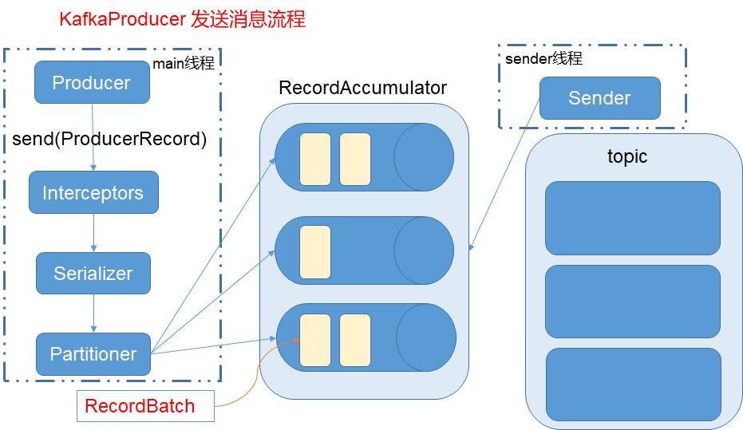

#### 生产者介绍
- 生产者： java语言编写
- 生产者（KafkaProducer）是线程安全的

#### 消息发送步骤
1. 配置生产者客户端参数
2. 创建生产者实例
3. 构建待发送的消息
4. 发送消息
5. 关闭生产者示例

#### 消息模型的定义 
- topic 主题
- partition 分区号
- headers 消息头部
- key 键，可以用来计算分区号
    - 有key的消息可以支持日志压缩的功能
- value 值
- timestamp 消息的时间戳

#### 生产者配置参数
- bootstrap.servers ： 连接broker的地址，建议至少设置两个以上
- key.serializer  : key的序列化类名
- value.serializer: value的序列化类名
    - 发送消息中的key/value会转换成二进制的字节数组发送
    - 消费者中的反序列化类要与生产者的序列化类匹配
- client.id 标识生产者的唯一id
- acks 只有三个值 
    - 1 leader副本成功写入消息，确定消息发送完成
    - 0 发送消息后不等待任何服务端响应，就确定消息发送完成
    - all 或 -1 ISR中所有副本成功写入消息后，确定消息发送完成
- min.insync.replicas ： 最少insync副本数量（包括leader副本），推荐设置成》=2
- max.request.size： 客户端发送消息的最大值，默认1MB
- retires 重试次数
- retry.backoff.ms 两次重试间时间间隔，默认100ms
- max.in.flight.requests.per.connection 如果保证分区有序，这个值设为1（影响整体吞吐量）
- compresstype 压缩类型，压缩是一种时间换空间的优化方式
    - gzip
    - snappy
    - lz4
- connections.max.idle.ms: 多久之后关闭空闲的连接
- linger.ms: 发送ProducerBatch之前最大等待时间
- send.buffer.bytes: 发送消息的缓冲区
    - 第一条消息加入起到最大等待时间或缓冲区满，发送消息
- receive.buffer.bytes: socket缓冲区大小，如果Producer和kafka不再一个机房，可以适当调大
- request.timeout.ms: 等待请求响应的最长时间
    - 需要比broker参数replica.lag.time.max.ms 值大，减少客户端重试引起的消息重复的概率
- max.in.flight.requests.per.connection: 每个连接最多缓存的未响应的请求数量，默认5
- 配置技巧
    - 配置参数时，参数key值使用ProducerConfig 类中定义的常量来完成
    - 序列化类使用类.getName()方法获取

#### 生产者API介绍
- 消息发送方法
    - 方法
        - Future result = producer.send(record)
        - Future result = producer.send(record,callback)
    - 发后即忘（fire-and-forget）：性能最高，可靠性最差
        - 不处理发送结果result
    - 同步发送（sync）: 可靠性高，性能差
        - result.get()
    - 异步发送（async）: 
        - 使用callback处理发送结果
        - 回调函数调用也可以保证分区有序
    - 重试（retires）
        - props.put(ProducerConfig.RETRIES_CONFIG,times)
 - 生产者关闭（close）： 保证消息发送完成，可以带超时时间
     - 实际应用中，使用无参数close方法
 - 序列化器（Serializer） & 反序列化器（Deserializer）
     - close方法须保证幂等性，kafka会多次调用
     - 序列化器和反序列化器必须匹配
     - 常用：Avro、JSON、Thrift、ProtoBuf、Protostuff 格式
 - 分区器（Partitioner）
     - 如果消息没有指定partition字段，kafka使用消息key计算partition，确定消息分区
     - 实现 Partitioner 接口
     - partition 值是int类型，表示分区号
     - 默认分区器：
         - key不为空，对key值进行hash运算，计算分区号
         - key为空，轮询算法确定分区号（仅在可用分区中轮询）
         - 不改变主题分区数量的前提下，key值与分区映射关系保持不变
         - 分区数改变，key值与分区映射关系也改变了
 - 生产者拦截器（ProducerInterceptor）
     - 实现 ProducerInterceptor 接口
     - 序列化和计算分区前调用拦截器的onSend方法
     - 消息被应答（Acknowledgement）之前或消息发送失败是调用 onAcknowledgement 方法
         - 调用优先于客户设置的callback 方法
         - 运行在producer IO线程中，onAcknowledgement方法要求处理速度快
 - 消息记录 ProducerRecord
 - 消息累加器 RecordAccumulator
 - 消息批次： ProducerBatch，包含一个或多个ProducerRecord
 - InFlightRequests ： 保存已发出但还没有收到响应的请求     
     - 如果未响应的请求超过连接最大数，则kafka不能再向这个链接发送消息
     - 非确认请求越多则系统负载越大   

#### 生产者架构

- 两个线程协调运行：主线程 和 Sender 线程
- 主线程中由kafka producer 创建消息，通过拦截器、序列化器、分区器后缓存到消息累加器
- Sender 线程负责从消息累加器中获取消息，并发送到kafka中
- RecordAccumulator 缓存配置参数：buffer.money 
    - 如果缓存空间不足，producer send 方法会阻塞，等待超时后抛出异常
    - 超时设置参数：max.block.ms
    - RecordAccumulator 中为每个分区维护一个双端队列，队列内容是批量消息
    - 缓存（BufferPool），batch.size 设置，默认16KB

#### 消费者
- 负责订阅主题（Topic）
- 消费者组（Consumer Group）： 消息发送到主题后，只会投递给消费者组中的一个消费者消费
- 横向伸缩性： 增加消费者组内消费者的数量，增加并发度（消费者数量最多不能超过分区的数量）
- 通知支持点对点（Point-to-Point） 和发布订阅（Pub/Sub）模式
    - 点对点：  所有消费者属于一个消费组
    - 发布/订阅： 消费者属于多个消费组
- 消费逻辑步骤
    1. 配置消费者客户端参数
    2. 创建消费者实例
    3. 订阅主题
    4. 拉取消息并消费
    5. 提交消费位移
    6. 关闭消费者实例
- kafka 消费者（Consumer）是非线程安全的
- 消费者参数
    - bootstrap.servers: kafka集群服务端地址
    - group.id: 消费者组名称
    - key/value.deserializer: key、值的反序列化器
    - 使用ConsumerConfig中常量避免配置项key设置错误
    - fetch.min.bytes： 一次拉取请求能从kafka中拉取的最小数据量
        - 适当调大会增加吞吐量，但是会造成额外的延迟（latency）
    - fetch.max.bytes： 一次拉取最大的数据量
        - 如果第一条消息大于设置值，消息仍然会返回
    - fetch.max.wait.ms: 最大等待时间
    - max.partition.fetch_bytes 从每个分区里返回consumer的最大数据量
    - max.poll.records 一次拉取请求拉取的最大消息数
    - connections.max.idle.ms 多久之后关闭空闲的连接
    - receive.buffer_bytes 接收消息的缓冲区
    - sender.buffer.bytes  发送消息的缓冲区
    - request.timeout.ms 请求响应的最长时间
    - metadata.max_age.ms 元数据的过期时间
        - 如果元数据超过过期时间没有更新，则会被强制更新
    - reconnect.backoff.ms 重新连接主机之前的等待时间
    - isolation.level 事务隔离级别
        - read_committed    consumer 忽略事务未提交的消息
        - read_uncommitted  默认值，consumer可以消费到高水位的位置
- 订阅分区
    - 三种订阅状态： AUTO_TOPICS、AUTO_PARTITIONS、USER_ASSIGNED
    - TopicPartition ：主题分区数据类
    - 订阅主题： consumer.subscribe(topics)
        - 多次订阅不同的主题，以最后一次为准
        - 可以使用正则表达式订阅： consumer.subscribe(Pattern.compile("regex"))
        - 具有消费者自动在均衡功能
    - 可以手动指定分区: consumer.assign(List<TopicPartition> partitions)
        - 手动指定分区不使用消费者组概念，不会分区重平衡
        - 查询主题分区信息： partitionsFor（topic）
    - 可以取消订阅： consumer.unsubscribe() 无参数
- 反序列化：Deserializer
    - configure
    - T <- deserializer(topic,data)
    - 不建议使用自定义的序列化器和反序列化器
    - 推荐使用包装使用通用序列化工具，如：json
- 消息消费
    - 消息系统：
        - 推模式  服务端主动将消息推送给消费者
        - 拉模式  消费者主动项服务端发起请求拉取消息
    - kafka： 只支持拉模式
        - ConsumerRecords<K,V> consumerpoll(timeout)
            - 如果线程唯一任务就是从kafka拉取消息，timeout可以设置成最大值Long.max_VALUE
            - 每条消息的类： ConsumerRecord
            - 批次消息的类： ConsumerRecords，包含多条ConsumerRecord
        - 指定位置消费消息
            - seek 从特定位置拉取消息
            - endOffsets 查询末尾消息位置
            - beginningOffset 查询队头消息位置
            - offsetsForTimes 通过时间戳查询消息位置
        - 位移异常处理
            - auto.offset.reset 配置
                - earliest 从最开始处开始消费
                - latest 从最后开始消费
                - none 抛出异常NoOffsetForPartitionException
    - 位移提交
        - offset 偏移量
            - 旧版本存放在zookeeper中
            - 新版本存放在内部队列 __consumer_offsets 中
            - offset 下一条拉取消息的位置
        - 手动提交
            - 同步提交 commitSync 
            - 异步提交 commitAsync
        - 自动提交
            - enable.auto.commit 设置为true
            - 不是每消费一条消息就提交一次，而是定期提交
            - auto.commit.interval.ms 定期提交时长，默认5秒
    - 消费者状态操作
        -  pause 暂停某些分区拉取数据
        -  resume 恢复某些分区拉取数据
        -  paused 查询暂停的分区
        -  close 关闭消费者
        -  wakeup 退出poll逻辑，并抛出异常WakeupException
            -  退出后要显示执行关闭动作
    - 再均衡
        - 再均衡指分区的所属权从一个消费者转移到另一个消费者的行为
        - ConsumerRebalanceListener 分区重平衡监听器
            - onPartitionsRevoked 在均衡开始之前，消费者停止读取消息后
                - 提交消息消费位移，避免消息重复消费
            - onPartitionsAssigned
                - 重新分配分区之后，消费者开始读取消息之前
    - 消费者拦截器 ConsumerInterceptor
        - onConsume
        - onCommit
    - 多线程处理
        - 每个线程对应一个consumer，每个consumer对应一个分区
            - 分区是消费者的最小划分单位
        - 消息处理模块改成多线程
            - 缺点
                - 消息处理顺序难以保证
                - 消费者位移提交困难，异常情况下会重复消费消息
                    - 滑动窗口实现方式
                    

#### 深入客户端
- 分区分配策略
    - RangeAssignor       每个主题下分区顺序分配给每个客户端（客户端按照字典顺序排序）
    - RoundRobinAssignor  所有主题所有分区排序后，通过轮询方式分配给每个客户端
    - StickyAssignor      
        - 目标1： 分区的分配尽可能均匀
        - 目标2： 分区的分配尽可能与上次分配保持相同
        - 目标1优先于目标2
    - 自定义分区策略 实现PartitionAssignor接口
    - 消费者协调器（ConsumerCoordinator）
    - 组协调器（GroupCoordinator）
- 事务
    - 消息传输保障3个层级
        - at most once
        - at least once
        - exactly once
    - 生产者幂等消息
        - 设置
            - 客户端参数 enable.idempotence true
            - retries 大于0
            - max.in.flight.requests.per.connection 参数值不大于5
            - acks 值为-1（all）
        - 实现
            - 生产者id（producer id，PID）
            - 序号（sequence number）
            - broker端为每一对（PID，分区）维护一个序列号
            - 收到的消息的序列号比borker端维护的序列号大1时，broker才会接收消息
        - 只能保证单个生产者回话中单分区的幂等
    - 事务消息
        - 事务性可以跨多个分区运行
        - 事务将消费消息、生产消息、提交消费位移当作原子操作执行
            - 使用控制消息实现事务，控制消息分为COMMIT 和 ABORT 
        - 限制
            - 必须开启幂等性特性
            - 客户端需要提供事务id（transactionId）
                - 事务id = 生产者id + producer_epoch（单调递增）
            - 消息消费者必须配置 isolation.level=read_commited
        - API
            - producer.initTransactions
            - producer.beginTransaction
            - producer.sendOffsetsToTransaction
            - producer.commitTransaction
            - producer.abortTransaction
        - 事务消息消费-转换-生产流程
            1. producer向broker发送请求查找事务协调器
            2. 事务协调器为当前生产者分配pid及producer_epoch
                - 1） 事务协调器提交（Commit） 或终止当前生产者未提交的事务
            3. producer 开启事务
            4. consume-transform-produce流程
                - 1）生产者向新分区发送消息前，需要先向事务协调器发送请求
                    - AddPartitionsToTxnRequest，绑定事务-分区关系
                    - 关系存放在内部队列 __transaction_state 中
                - 2）生产者发送消息
                - 3）生产者向事务协调者发送 AddOffsetsToTxRequest 请求
                    - 事务协调者通过group_id推算出offset 在 __consumer_offsets 中的分区
                    - 将分区保存在 __transaction_state 中
                - 4）生产者向事务协调者发送TxnOffsetCommitReqest
                    - 将本次事务中消费位移信息offsets存储到主题 __consumer_offsets 中
            5. 提交（终止）事务：生产者向事务协调者发送EndTxnRequest
                - 1） 事务协调者将PREPARE_COMMIT（PREPARE_ABORT）消息写入主题 __transaction_state
                - 2） 通过WriteTxnMakersRequest 将COMMIT(ABORT)消息写入用户所使用的的主题
                    - 事务协调者发送给各个分区的leader节点
                    - 节点收到请求，会在分区中写入控制消息，标识事务的中介
                - 3） 将COMMIT(ABORT)消息写入 __consumer_offsets
                - 4） 将COMPLETE_COMMIT(COMPLETE_ABORT) 消息写入主题  __transaction_state