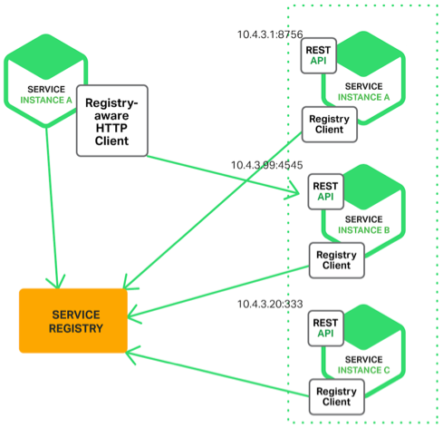

### 可扩展架构
- 可扩展架构基本思想： 拆
    - 面向流程（数据移动流程）拆分：分层架构
    - 面向服务拆分：SOA、微服务架构
    - 面向功能拆分：微内核架构
     
#### 1. 分层架构
    - 保证各层之间差异足够清晰，边界足够明显
    - 保证层与层之间的依赖是稳定的
    - 业务流程依层依次传递，不能再层之间跳跃
    - 本质：隔离关注点
    - 缺点：有些罗嗦和冗余，但是复杂度不高
    
#### 2. SOA
    - 服务
    - ESB：需要实现与各种系统间的协议转换、数据转换、透明的动态路由等，会成为性能瓶颈
    - 松耦合：服务独立运行，通过ESB交换数据
    
#### 3. 微服务架构
- 与SOA本质差异： small、lightweight、automated
    - 服务粒度要细
    - 轻量级，使用统一的协议和格式
    - 自动化：采取自动化测试、持续集成、自动化部署等敏捷开发相关的最佳实践 
    - 业务变化快，需要快速尝试、快速交付
- 微服务的常见陷阱
    - 服务划分过细，服务间关系复杂: n 个服务的复杂度是 n×(n-1)/2                      
    - 服务数量太多，团队效率急剧下降
    - 调用链太长，性能下降
    - 调用链太长，问题定位困难
    - 没有自动化支撑，无法快速交付
    - 没有服务治理，微服务多了后管理混乱
- 微服务最佳实践
    - 服务粒度
        - 设计开发阶段，基于团队规模进行拆分，每三个人一个微服务（避免单点故障）
        - 维护阶段，可以2人维护多个微服务
    - 拆分方法
        - 基于业务逻辑拆分： 先计算拆分微服务个数，在确定合适的职责范围
        - 基于可扩展性拆分： 稳定服务/变动服务
        - 基于可靠性拆分  
            - 避免非核心服务故障影响核心服务
            - 核心服务高可用方案可以更简单
            - 持续降低考可用成本
        - 基于性能拆分 与基于可靠性拆分类似  
     - 基础设施：服务发现、服务路由、服务容错、服务监控、服务跟踪、服务安全、自动化测试、自动化部署、配置中心、接口框架、API网关
        - 微服务基础设施全家桶： Spring Clound
        - 搭建优先级
            - 1） 服务发现、服务路由、服务容错
                - 服务发现 支撑微服务的自动注册和发现
                    - 自理式：每个微服务自己完成服务发现
                                              
                    - 代理式：负载均衡组件完成服务发现
                        - 风险较大
                        - 可用性风险： 如果负载均衡组件故障，微服务全部不可用
                        - 性能风险：   全部流量都要通过负载均衡组件
                        - 负载均衡组件集群实现增加复杂性                        
                - 服务路由： 和服务发现一起设计
                    - 常见算法： 随机路由、轮询路由、最小压力路由、最小连接数路由
                - 服务容错    
                    - 微服务具有故障扩散的特点
                    - 重试、流控和服务隔离
            - 2） 接口框架、API网关
                - 接口框架： 统一接口协议、统一传递的数据格式
                - API网关 ： 外部系统访问的接口，提供接入鉴权、权限控制、传输加密、请求路由、流量控制等功能                                        
            - 3） 自动化部署、自动化测试、配置中心
                - 自动化测试：单元测试、单个系统集成测试、系统间接口测试
                - 自动化部署： 版本管理、资源管理、部署操作、回退操作
                - 配置中心： 版本管理、节点管理、配置同步、配置推送                                
            - 4） 服务监控、服务跟踪、服务安全
                - 服务监控
                    - 实时搜集信息并进行分析，避免故障后再来分析，减少了处理时间
                    - 服务监控可以在实时分析的基础上进行预警 
                    - 数据量大，建议做成独立的系统，而不要集成到服务发现、API 网关等系统
                - 服务跟踪 基于 Google 的 Dapper 论文
                    - zipkin
                    - pinpoint 
- 接口级故障处理
    - 原则：优先保证核心业务和优先保证绝大部分用户 
    - 降级
        - 核心思想是丢车保帅，优先保证核心业务
        - 应对系统自身的故障
    - 熔断
        - 应对依赖外部系统的故障
        - API调用层收集数据，执行逻辑
    - 限流
        - 从用户访问压力角度应对故障
        - 基于请求限流：限制总量、限制时间范围内某个指标的量
        - 基于资源限流：
            - 限制系统内关键资源使用上限，如： 数据库连接数、线程数
    - 排队： 限流的变种，用户体验不一定比限流好
    
#### 4. 微内核架构（插件化架构）
- 核心组件：
    - 核心系统（core system）
    - 插件模块（plug-in modules） 
- 关键技术
    - 插件管理：插件注册表，包括插件的名字、位置、加载时机
    - 插件连接：核心系统必须制定插件和核心系统的连接规范，插件按规范设计           
    - 插件通信：核心系统提供通信机制，供插件间交换数据
- 实例：
    - OSGI: Equinox/Spring DM
    - 规则引擎:
        - 开发人员将业务功能分解提炼为多个规则，将规则保存在规则库中。
        - 业务人员根据业务需要，通过将规则排列组合，配置成业务流程，保存在业务库中
        - 规则引擎执行业务流程实现业务功能
        - 规则 -- 插件 ， 规则引擎 -- 核心系统 ， 规则库/业务库 -- 注册中心  