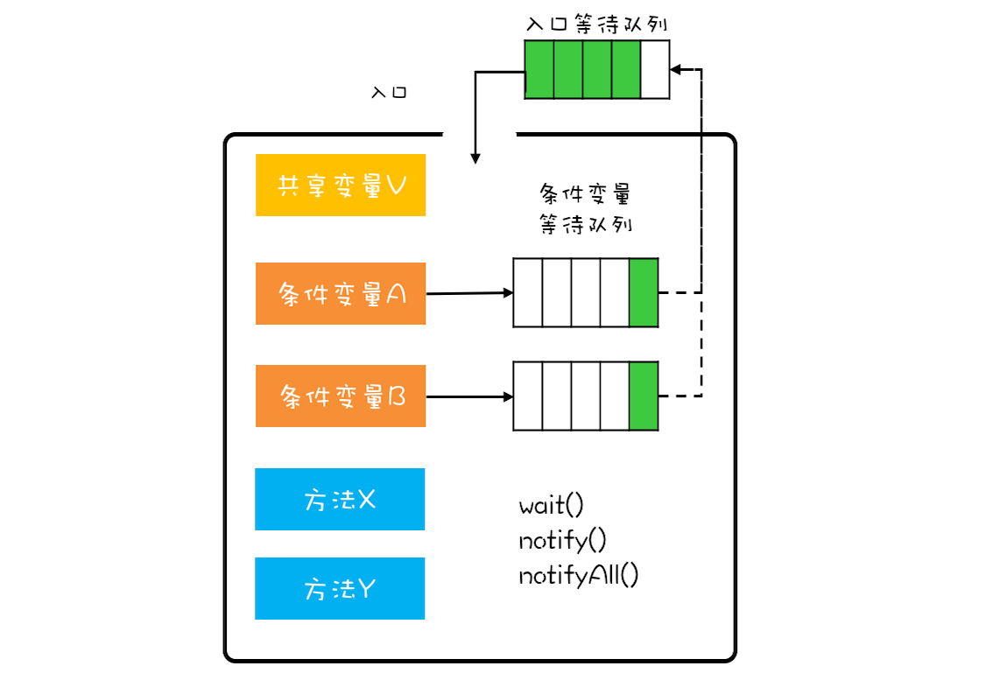

### 同步解决的问题
- 线程之间如何协作

### 同步的模式
#### 1. 管程(Monitor): synchronized & lock
- 管程（Monitor）： 管理共享变量以及对共享变量的操作过程，让他们支持并发
- 组成部分： synchronized、wait、notify、notifyAll
- 信号量和管程是等价的
- MESA模型
    
- 解决互斥问题
    - 管程将共享变量及操作共享变量的方法封装起来
    - 只允许一个线程进入管程
    <pre>
        monitor X{
            //共享变量，队列
            var queue
            //操作： 入队
            func enq()
            //操作： 出队
            func deq();
        }
    </pre>
- 解决同步问题
    - 入口等待队列
        - 已有线程进入管程，其他线程都需要进入入口等待队列
        - 其他线程离开管程，队列中选择一个线程进入管程
    - 条件变量等待队列：
        - 调用 wait/await 进入
        - 调用notify/signal、notifyAll 出队列，并加入入口等待队列
        - 进入条件等待队列的线程，自动离开管程
    - wait 用法： 使用while(条件不满足){wait()}
        - 不能使用if
        - 原因是线程唤醒时，之前满足的条件，现在已经不满足了
        - 执行notfiy/signal操作后，当前线程并不会阻塞
    - 只有满足以下三个条件，才使用notify，否则使用notifyAll
        - 所有等待线程拥有相同的等待条件
        - 所有等待线程被唤醒后，执行相同的操作
        - 只需要唤醒一个线程
- synchronized 是对MESA模型的简化，只有一个条件变量 

#### 2. 信号量（Semaphore）：
- 一个计数器，一个等待队列，三个方法
    - init 设置计数器初始值
    - down 计数器值减一，如果计数器值小于0，将线程加入等待都咧，并阻塞线程
    - up   技术器值加一，如果计数器的值小于等于0，则唤醒等待队列里的一个线程，并从等待队列中移除。
    - java里
        - init ： 构造函数
        - down ： acquire
        - up   ： release 
    - 可中断/可设置等待时间
    - 信号量大于1，可能有多个线程进入临界区
    
#### 3. CountDownLatch：不可重用
- countDown 记录事件发生
- await 等待事件发生次数后唤醒
    
#### 4. CyclicBarrier： 可重用
- await 
- 全部线程调用await才会继续
- 侧重点是线程

#### 5. Phaser
- CountDownLatch 类似
        
#### 6. Exchanger
- 运行流程：
    - 两个线程共用一个Exchanger对象
    - 一个线程中调用Exchanger对象的exchange方法，传入被交换的数据，阻塞等待
    - 等待另一个线程调用Exchanger对象的exchange方法时，传入被交换的数据，并取得另一个线程的交换数据
    - 另一个线程获取到交换的数据
