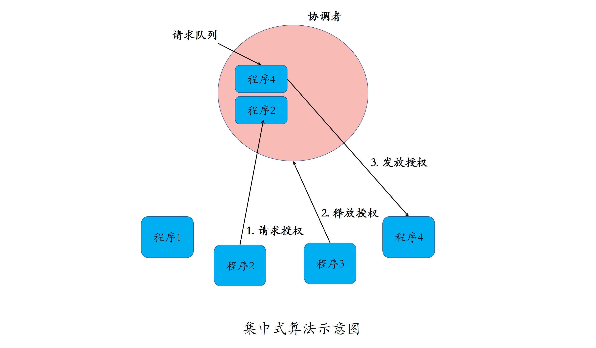
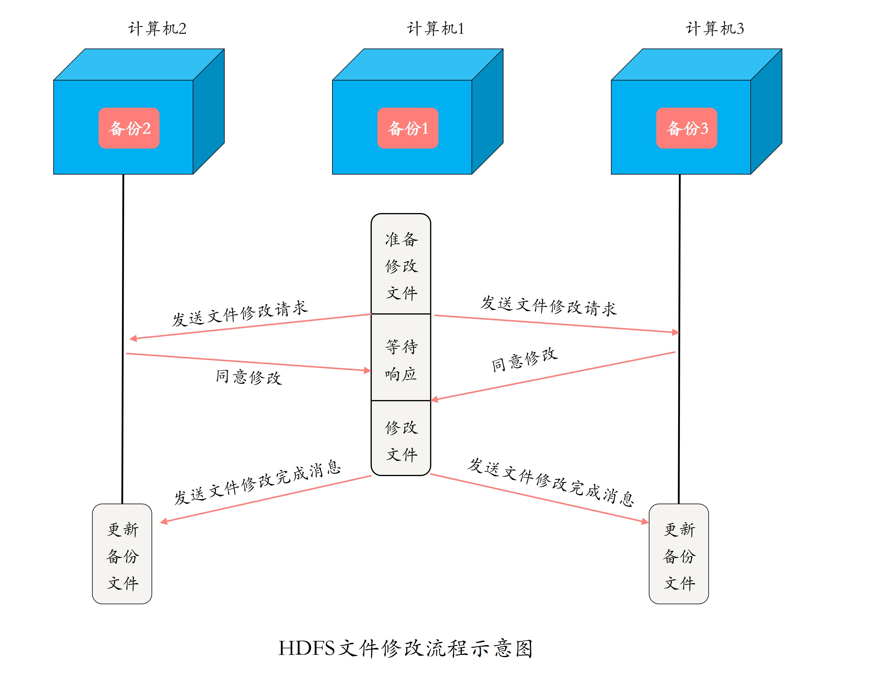

#### 分布式互斥
- 分布式互斥： 分布式系统里，排他性的资源访问方式
- 临界资源（Critical Resource）： 被互斥访问的共享资源
- 临界资源方法算法
    - 集中式算法： 
        - 访问临界资源前，先给协调者程序发送请求申请使用资源
        - 如果资源未被使用，程序获得授权，并标记资源为已使用
        - 否则程序进行排对，等其他程序释放资源后，协调者给排队程序发放授权
        - 资源使用后，程序向协调者发送请求，释放资源
        
        - 优点：
            1. 简单、易于实现
        - 问题：
            1. 协调者会成为系统的性能瓶颈
            2. 协调者存在单点故障问题
        - 使用集中式算法，一定要选择性能好、可靠性高的服务器来运行协调者
    - 民主协商： 分布式算法（组播和逻辑时钟的算法）
        - 使用资源的程序A组播消息，申请使用资源
        - 其他程序全部同意后，A获得资源使用授权
        - A使用完资源后，释放资源，并同意队列中下一个申请者使用资源
        - 如果其他程序不同意A使用资源，将A放入队列排队，待当前资源使用方释放资源后，再授权A使用资源
        - 问题
            1. 算法可用性低，需要访问资源程序增多，容易产生信令风暴 
            2. 如果某个程序故障，其他程序等待该程序的答复，系统停滞
        - 适用范围：
            - 节点数少且变动不频繁，如： HDFS 
            - 临界资源使用频度较低
        
    - 令牌环算法 
        - 所有程序构成环结构
        - 令牌按照顺时针方向在环内船里，收到令牌的程序有权访问临界资源
        - 程序不需要访问临界资源，将令牌传递给下一个程序
        - 使用范围
            - 令牌环算法非常适合通信模式为令牌环方式的分布式系统
            - 移动自组织网络系统，如： 无人机通信
            - 系统规模较小，并且系统中每个程序使用临界资源的频率高且使用时间短
    - 两层结构的分布式令牌环算法
        - 一层是广域网节点
        - 一层是广域网内局域网节点
        - 适用于大规模系统
    

#### TODO 分布式锁