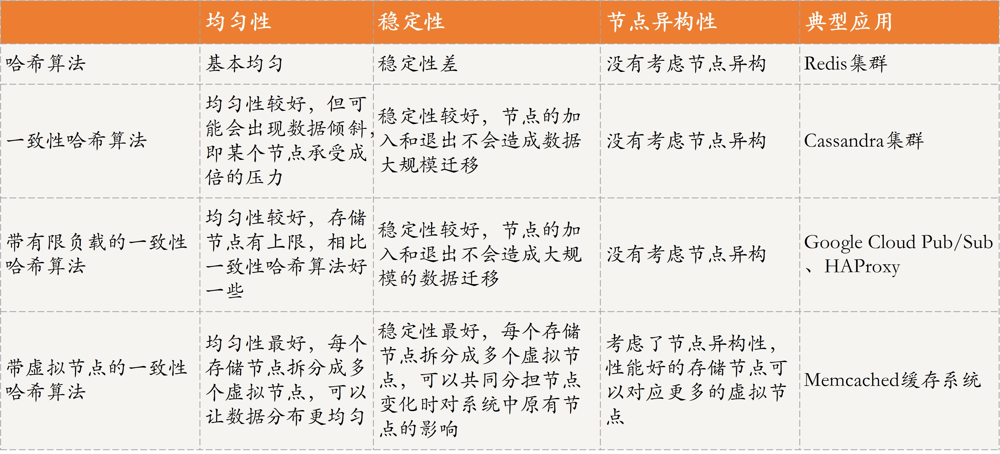
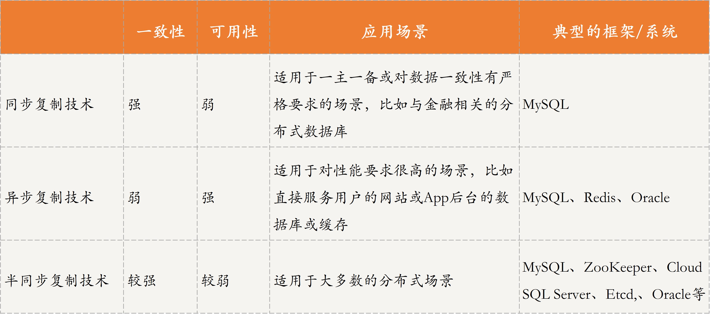

#### 分布式存储系统
- 关键三要素
    - 数据生产者/消费者
        - 数据格式 
            - 结构化数据       关系模型数据                           --> 分布式关系数据库
            - 半结构化数据     非关系模型的，有基本固定结构模式的数据 --> 分布式键值系统
            - 非结构化数据     特征是数据之间关联不大                 --> ElasticSearch、Ceph、GFS、HDFS
    - 数据索引
        - 确定数据位置
        - 数据分片技术
            - 分布式存储系统按照一定的规则将数据存储到相对应的存储节点中，或者到相对应的存储节点中获取想要的数据
            - 降低单个存储节点的存储和访问压力
            - 通过规定好的规则快速找到数据所在的存储节点，从而大大降低搜索延迟
            - 分片方案
                - 数据范围
                - 哈希映射
                - 一致性哈希环
        - 数据复制也是一个非常重要的方法
        - 实际的分布式存储系统中，数据分片和数据复制通常是共存的
    - 数据存储
        - 分布式数据库   MySQL Sharding、Microsoft SQL Azure、Google Spanner、Alibaba OceanBase
        - 分布式键值系统 Redis、Memcache
        - 分布式存储系统 Ceph、GFS、HDFS
        - 本质就是选择将数据存储在磁盘还是内存

#### 数据分布方式
- 选型考虑维度
    - 数据均匀    存储的数据要尽量均衡，用户访问也要做到均衡
    - 数据稳定    存储节点移除或者扩增时，不要出现大范围的数据迁移
    - 节点异构性  分布过程考虑硬件配置差异
    - 隔离故障域  比如不同机房、不同机架等
    - 性能稳定性  不能因为节点的添加或者移除，造成存储或访问性能的严重下降
- 分布方法
    - 哈希分布
        - 计算得到数据与处理节点的关系，不需要存储映射
        - 均匀性好，稳定性差,
        - 存在倾斜的问题(TODO ? 具体什么问题 ？ )
        - 扩容需要迁移数据
        - 适用于同类型节点且节点数量比较固定的场景
    - 一致性哈希
        - 计算方法
            - 1）计算哈希值，映射得到结果 
            - 2）找到比该结果大的第一个节点
        - 稳定性好，可以动态添加、删除节点
        - 均匀性问题也比较明显，存在平衡性问题
        - 一致性哈希方法比较适合同类型节点、节点规模会发生变化的场景
    - 带有限负载的一致性哈希算法
        - 比较适合同类型节点、节点规模会发生变化的场景
    - 带虚拟节点的一致性哈希
        - Memcached 缓存系统实现了该方法
        - 增加了节点规模，从而增加了节点的维护和管理的复杂度
    - 路由表
            - 需要全局计算的节点
            - 风险：数据集中式管理，存在单点风险
- 

#### 数据复制技术
- 数据复制技术，可以保证存储在不同节点上的同一份数据是一致的
- 数据复制技术实际就是指，如何让主备数据库保持数据一致的技术
- 数据复制方法分类
    - 同步复制
        - 主数据库必须要同步到备数据库之后才可给用户返回
        - 保证了数据的强一致性，但牺牲了系统的可用性
        - 同步复制技术经常用于分布式数据库主备场景，或对数据一致性有严格要求的场合
    - 异步复制
        - 主数据库处理完请求后可直接给用户响应，不必等待备数据库完成同步
        - 保证了系统的可用性，但牺牲了数据的一致性
        - MySQL 集群默认的数据复制模式采用的是异步复制技术
        - 应用在对用户请求响应时延要求很高的场景
    - 半同步复制
        - 用户发出写请求后，主数据库会执行写操作，并给备数据库发送同步请求，等待一部分备数据库同步完成后响应用户写操作执行成功
    - 多数的分布式存储系统可以通过配置来选择不同的数据复制技术
    - 
    
#### 分库分表工具
- sharding-jdbc 架构图