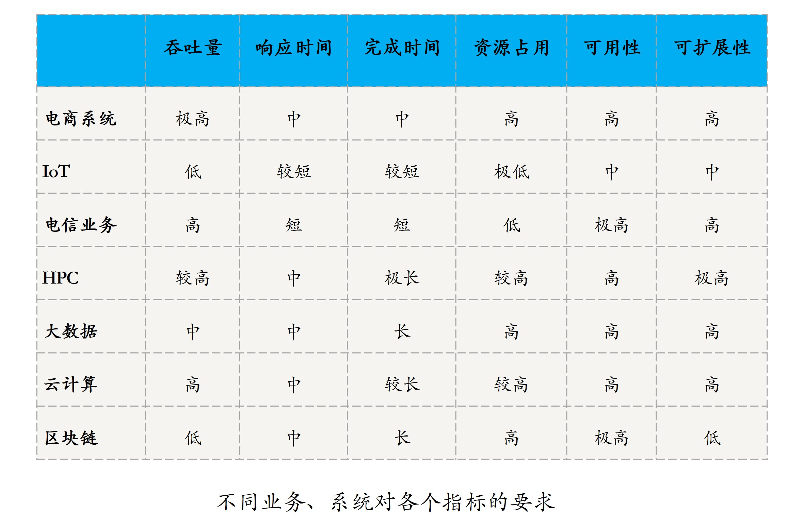

#### 分布式系统指标
- 更多的机器，处理更多的数据和更复杂的任务
- 指标
    - 性能
        - 吞吐量
        - 响应时间
        - 完成时间
    - 资源占用
    - 可用性：系统停止服务的时间与总的时间之比衡量 
    - 可扩展性（Scalability）通过扩展集群机器规模提高系统性能 
- 各类系统对指标要求

    - IoT 最看重的是资源占用指标， 可用资源通常都是 KB 级 
    - HPC 高性能计算