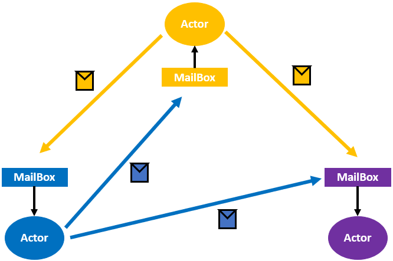

#### Actor

- Actor 类似于一个“黑盒”对象，封装了自己的状态和行为
- 多个 Actor 之间通过消息进行通信
- Actor 模型的三要素是状态、行为和消息
    - 状态（State）  Actor 的状态会受 Actor 自身行为的影响，且只能被自己修改
    - 行为（Behavior） Actor 之间不能直接调用其他 Actor 的计算逻辑。Actor 只有收到消息才会触发自身的计算行为
    - 消息（Mail）
        - 每个 Actor 会有一个自己的邮箱（MailBox），用于接收来自其他 Actor 的消息
        - Actor 是按照消息达到的先后顺序（FIFO）进行读取和处理的

- Actor 关键特征
    - 实现了更高级的抽象
    - 非阻塞性
    - 无需使用锁
    - 并发度高
    - 易扩展
- Actor的不足
    - Actor 模型不适用于对消息处理顺序有严格要求的系统
    - 工程中不易实现 Actor 模型
    - Actor 提供了模块和封装，但缺少继承和分层