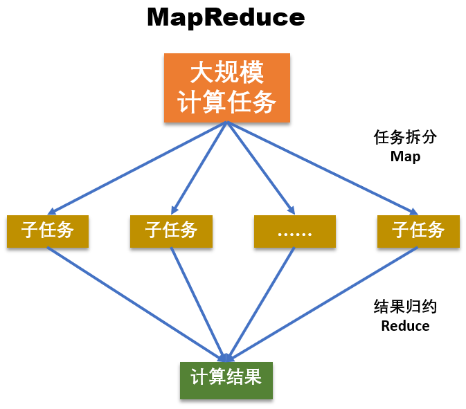
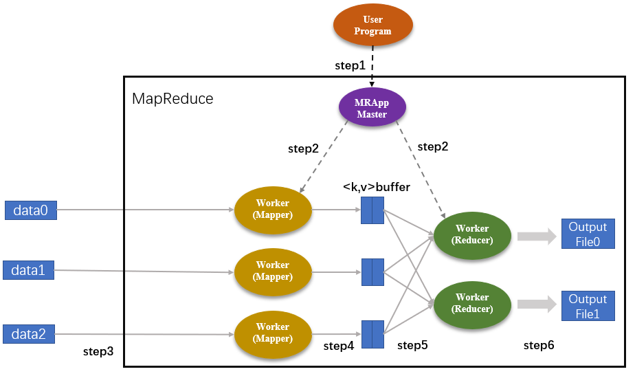

#### MapReduce 分而治之
- 任务运行完成之后，整个任务进程就结束了，属于短任务模式
- MapReduce 对处理实时性的任务就不太合适了
- 批量计算的一个缺点就是，从数据采集到得到计算结果之间经历的时间很长
- 采用分治法解决问题的核心步骤
    - 分解原问题。将原问题分解为若干个规模较小，相互独立，且与原问题形式相同的子问题
    - 求解子问题。若子问题规模较小且容易被解决则直接求解，否则递归地求解各个子问题
    - 合并解，就是将各个子问题的解合并为原问题的解
- MapReduce

    - 分为 Map 和 Reduce 两个核心阶段
    - Map 对应分
    - Reduce 对应着合
    - 工作流程主要可以概括为 5 个阶段，
        - Input（输入）
        - Splitting（拆分）
        - Mapping（映射）
        - Reducing（化简）
        - Final Result（输出）
    - Fork-Join 又被称为 Java 版的 MapReduce 框架