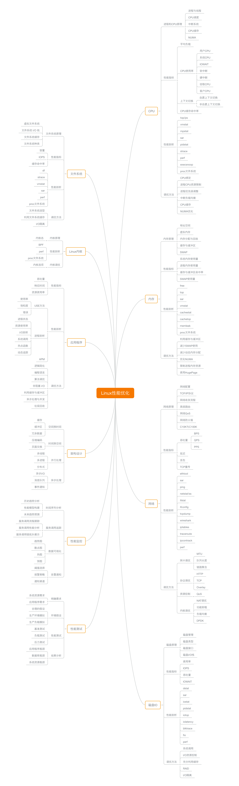
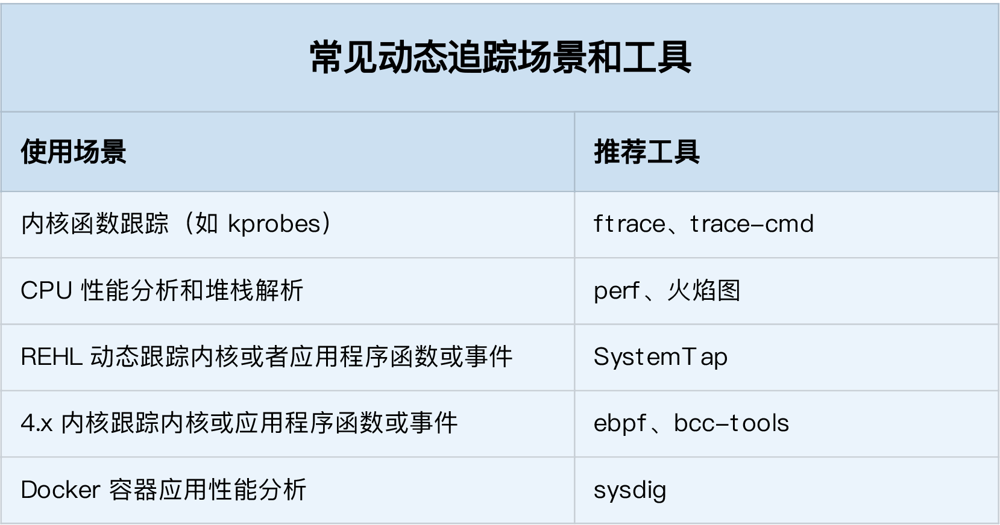

### linux性能优化概述
- CPU 性能、磁盘 I/O 性能、内存性能、网络性能
- 平均负载，上下文切换，Linux 内存的工作原理
- 性能指标
    - 从应用负载的视角： 吞吐、延时
    - 从系统资源的视角： 资源使用率、饱和度
- 性能问题的本质：系统资源已经达到瓶颈，但请求的处理却还不够快，无法支撑更多的请求
- 性能分析： 找出应用或系统的瓶颈，并设法去避免或者缓解它们
- 最核心的话题： 建立起整体性能的全局观
    - 理解最基本的几个系统知识原理
    - 掌握必要的性能工具
    - 通过实际的场景演练,贯穿不同的组件 --> 理解组件最基本的工作原理和协作方式

- Linux 性能工具图谱

- 性能分析和优化知识图谱

### Linux性能指标工具（CPU）
- 平均负载
    - 命令：uptime
    - 02:34:03 up 2 days, 20:14, 1 user, load average: 0.63, 0.83, 0.88
    - load average 1分钟、5分钟、15分钟的平均负载
    - 平均负载是指单位时间内，系统处于可运行状态和不可中断状态的平均进程数，也就是平均活跃进程数
    - 可运行状态的进程，是指正在使用 CPU 或者正在等待 CPU 的进程--> ps命令 R状态
    - 不可中断状态的进程则是正处于内核态关键流程中的进程，并且这些流程是不可打断的 --> ps命令 D状态
        - 不可中断状态实际上是系统对进程和硬件设备的一种保护机制
    - 平均负载最理想的情况是等于 CPU 个数
        - 查看CPU个数的命令： grep 'model name' /proc/cpuinfo | wc -l
    - 平均负载比CPU个数还大-->过载
    - 当平均负载高于 CPU 数量 70% 的时候，就应该分析排查负载高的问题
    - 最推荐的方法，监控系统的平均负载,根据历史数据，判断负载的变化趋势
    - 不仅包括了正在使用 CPU 的进程，还包括等待 CPU 和等待 I/O 的进程
    - CPU密集型进程, 平均负载与CPU使用率一致
    - IO密集型进程，平均负载与CPU使用率不一致
    - 负载高的原因分析
        - 查看资源使用率命令： mpstat -P ALL 5
            - -P ALL 表示监控所有CPU，后面数字5表示间隔5秒后输出一组数据
        - 分进程查看资源使用率命令： pidstat -u 5 1
- CPU 上下文切换
    - 场景： 进程上下文切换、线程上下文切换、中断上下文切换
    - 从用户态到内核态的转变，需要通过系统调用来完成 --> 系统调用发生 CPU 上下文的切换呢
        - 一次系统调用的过程，其实是发生了两次 CPU 上下文切换
        - 系统调用过程通常称为特权模式切换，而不是上下文切换
    - 进程的上下文切换
        - 先把该进程的虚拟内存、栈等保存        （用户态）
        - 再保存当前进程的内核状态和 CPU 寄存器 （内核态）
        - 每次上下文切换都需要几十纳秒到数微秒的 CPU 时间
        - 触发进程调度的场景
            - 进程的时间片耗尽了
            - 系统资源不足（比如内存不足）时
            - 睡眠函数 sleep 这样的方法将自己主动挂起时
            - 有优先级更高的进程运行时
            - 发生硬件中断时
    - 线程上下文切换
        - 如果和切换后线程不属于同一个进程，和进程切换一致
        - 如果和切换后线程属于同一个进程
            - 不需要修改共享相同的虚拟内存和全局变量等资源
            - 需要保存线程也有自己的私有数据，比如栈和寄存器等
        - 同进程内的线程切换，要比多进程间的切换消耗更少的资源
    - 中断上下文切换
        - 中断上下文切换并不涉及到进程的用户态
        - 不需要保存和恢复这个进程的虚拟内存、全局变量等用户态资源
        - 只包括内核态中断服务程序执行所必需的状态
    - 命令： vmstat
        - cs（context switch）是每秒上下文切换的次数
        - in（interrupt）则是每秒中断的次数
        - r（Running or Runnable）是就绪队列的长度，也就是正在运行和等待 CPU 的进程数。
        - b（Blocked）则是处于不可中断睡眠状态的进程数。
    - 命令： pidstat -w
        - cswch ，表示每秒自愿上下文切换（voluntary context switches）的次数
            - 自愿上下文切换，是指进程无法获取所需资源，导致的上下文切换
        - nvcswch，表示每秒非自愿上下文切换（non voluntary context switches）的次数
            - 非自愿上下文切换，则是指进程由于时间片已到等原因，被系统强制调度，进而发生的上下文切换
        - 可选参数 -t 参数，表示线程上下文切换数据
    - 中断数据读取
        - /proc/interrupts 这个只读文件中读取
    - 当上下文切换次数超过一万次，或者切换次数出现数量级的增长时，就很可能已经出现了性能问题
        - 自愿上下文切换变多了，说明进程都在等待资源，有可能发生了 I/O 等其他问题
        - 非自愿上下文切换变多了，说明进程都在被强制调度，也就是都在争抢 CPU，说明 CPU 的确成了瓶颈
        - 中断次数变多了，说明 CPU 被中断处理程序占用，还需要分析具体的中断类型
- CPU 使用率
    - 使用率计算： 
        - 一段时间内指标得差值  
        
    - 总CPU使用数据： /proc/stat
    - 每个进程的cpu使用数据： /proc/[pid]/stat
    - 命令： top 显示了系统总体的 CPU 和内存使用情况，以及各个进程的资源使用情况
    - 命令： ps 显示了每个进程的资源使用情况
    - 命令： pstree 查看进程树
    - perf工具
        - 命令： perf top  实时显示占用 CPU 时钟最多的函数或者指令
        - 命令： perf record 则提供了保存数据的功能，保存后的数据，需要你用 perf report 解析展示
        - -g 参数： 开启调用关系采样
    - 排查思路
        - 用户 CPU 和 Nice CPU 高 --> 着重排查进程的性能问题
        - 系统 CPU 高 --> 着重排查内核线程或者系统调用的性能问题
        - I/O 等待 CPU 高 --> 着重排查系统存储是不是出现了 I/O 问题
        - 软中断和硬中断高 --> 着重排查内核中的中断服务程序
    - 工具： execsnoop 专为短时进程设计的工具
    - 常规问题无法解释的 CPU 使用率情况时，首先要想到有可能是短时应用导致的问题
        - 应用里直接调用了其他二进制程序，这些程序通常运行时间比较短，通过 top 等工具也不容易发现
        - 应用本身在不停地崩溃重启，而启动过程的资源初始化，很可能会占用相当多的 CP
    - 进程状态
        - R 就绪，正在运行/等待运行
        - D 不可中断睡眠，表示进程正在跟硬件交互，不允许被其他进程或中断打断
        - Z 表示僵尸进程，也就是进程实际上已经结束了
        - S 可中断状态睡眠，表示进程因为等待某个事件而被系统挂起
        - I 空闲状态 
        - T 进程处于暂停或者跟踪状态
        - X 进程已经消亡
    - 工具： dstat 可以同时观察系统的 CPU、磁盘 I/O、网络以及内存使用情况
    - 进程长时间处于不可中断状态，通常表示系统有 I/O 性能问题
    - 进程长时间处于僵尸状态，就应该注意了，可能有应用程序没有正常处理子进程的退出
    - 工具： strace 常用的跟踪进程系统调用的工具
    - 软中断
        - 中断是一种异步的事件处理机制，可以提高系统的并发处理能力
        - 中断处理程序在响应中断时，还会临时关闭中断 --> 中断有可能会丢失
        - Linux 将中断处理过程分成了两个阶段
            - 上半部用来快速处理中断,在中断禁止模式下运行，主要处理跟硬件紧密相关的或时间敏感的工作
            - 下半部用来延迟处理上半部未完成的工作，通常以内核线程的方式运行 <-- 软中断信号通知下半部
        - 一些内核自定义的事件也属于软中断，如： 内核调度和 RCU 锁
        - /proc/softirqs 提供了软中断的运行情况，/proc/interrupts 提供了硬中断的运行情况
        - 网络工具： sar
    - CPU 缓存的命中率
    
- 性能指标和性能工具联系
    - 从 CPU 的性能指标出发，查看某个性能指标时，要清楚知道哪些工具可以做到
        
    - 从工具出发，要知道这个工具能提供哪些指标
        
    - 优先运行支持指标多的工具，缩小问题的范围
        
- 优化 CPU 性能问题的思路和注意事项
    - 怎么评估性能优化的效果 
        - 确定性能的量化指标   --> 应用程序的维度+系统资源的维度,不要局限在单一维度的指标上
        - 测试优化前的性能指标
        - 测试优化后的性能指标
    - 怎么选择需要优化的性能问题
        - 首先完成系统资源瓶颈的优化的问题
        - 接下来去优化那些由瓶颈导致的，性能指标变化幅度最大的问题
    - 怎么选择性能优化的方法
        - 性能优化并存在成本，需要权衡利弊
        
#### Linux性能指标工具（内存）  
- 虚拟内存
    - 内核空间   
    - 用户空间
    - 内存映射： 虚拟内存地址映射到物理内存地址
        - 内核为每个进程都维护了一张页表，记录虚拟地址与物理地址的映射关系
        - 页表实际上存储在 CPU 的内存管理单元 MMU 中
        - MMU使用页（4 KB）来管理内存
        - 解决页表项过多的问题
            - 多级页表： Linux 用的正是四级页表来管理内存页，虚拟地址被分为 5 个部分，前 4 个表项用于选择页，而最后一个索引表示页内偏移
                
            - 大页（HugePage）：比普通页更大的内存块，常见的大小有 2MB 和 1GB，比如Oracle、DPDK 等
    - 当进程访问的虚拟地址在页表中查不到时，系统会产生一个缺页异常，进入内核空间分配物理内存、更新进程页表，最后再返回用户空间，恢复进程的运行
    - 虚拟内存分布
        
        - 内核空间
        - 程序栈   局部变量和函数调用的上下文等
        - 文件映射 动态库、共享内存等，从高地址开始向下增长
        - 堆     动态分配的内存，从低地址开始向上增长
        - 数据段 全局变量
        - 只读段 代码和常量
- 内存分配与回收
    - malloc() 是 C 标准库提供的内存分配函数，对应两种系统调用，brk() 和 mmap()
        - 当这两种系统调用发生后，其实并没有真正分配内存
        - 只在首次访问时才分配，也就是通过缺页异常进入内核中，再由内核来分配内存
    - 应用程序用完内存后，还需要调用 free() 或 unmap() ，来释放这些不用的内存
- 工具： free
    - Buffers 对原始磁盘块的临时存储，用来缓存磁盘的数据
    - Cached 是从磁盘读取文件的页缓存，用来缓存从文件读取/写入的数据
    - SReclaimable 是 Slab 的一部分。
        - 可回收部分，用 SReclaimable 记录；
        - 不可回收部分，用 SUnreclaim 记录
- 工具： top
    - VIRT 是进程虚拟内存的大小
    - RES 是常驻内存的大小
    - SHR 是共享内存的大小
    - %MEM 是进程使用物理内存占系统总内存的百分比
- 工具： cachestat 查询系统缓存命中数据  
- 工具： cachetop  查看进程的缓存命中数据   不把直接 I/O 算进来
- 工具： pcstat    查看文件在内存中的缓存大小以及缓存比例
- 工具： memleak   专门用来检测内存泄漏的工具
- 工具： sar 
- 内存回收
    - 直接内存回收： 有新的大块内存分配请求，但是剩余内存不足
    - 专门的内核线程（kswapd0）用来定期回收内存
        - 剩余内存小于页最小阈值 只有内核才可以分配内存
        - 剩余内存落在页最小阈值和页低阈值中间 kswapd0 会执行内存回收，直到剩余内存大于高阈值为止
        
        - 内核选项 /proc/sys/vm/min_free_kbytes 设置页最小阈值
        - pages_low = pages_min*5/4
        - pages_high = pages_min*3/2
    - 系统剩余内存还多着，Swap 升高的原因--> 处理器的 NUMA架构
        - numactl --hardware 查看每个node的内存情况
    - 某个 Node 内存不足时，内存回收方式
        - /proc/sys/vm/zone_reclaim_mode 配置
        - 0（默认值）： 系统可以从其他 Node 寻找空闲内存，也可以从本地内存中回收内存
        - 1  只回收本地内存
        - 2  只回收本地内存，可以回写脏数据回收内存
        - 4  只回收本地内存，可以用 Swap 方式回收内存
- 缺页异常
    - 次缺页异常 可以直接从物理内存中分配时
    - 主缺页异常 需要磁盘 I/O 介入（比如 Swap）时
- 内存性能指标项： 

- 内存性能工具： 
- 性能指标和工具的联系
    - 从内存指标出发，可使用工具
        
    - 从性能工具出发，查看提供的内存指标
        
    - 优先运行几个覆盖面比较大的性能工具，比如 free、top、vmstat、pidstat
        
- 内存调优思路
    - 最好禁止 Swap
    - 减少内存的动态分配
    - 尽量使用缓存和缓冲区来访问数据
    - 使用 cgroups 等方式限制进程的内存使用情况
    - 通过 /proc/pid/oom_adj ，调整核心应用的 oom_score。这样，可以保证即使内存紧张，核心应用也不会被 OOM 杀死
    
#### Linux性能指标工具（IO） 
- 文件的两个数据结构
    - 索引节点（index node，简称inode）    记录文件的元信息，比如 inode 编号、文件大小、访问权限、修改日期、数据的位置等
        - 持久化存储到磁盘中
    - 目录项（directory entry，简称dentry）用来记录文件的名字、索引节点指针以及与其他目录项的关联关系
        - 目录项是由内核维护的一个内存数据结构
        - 目录项和索引节点的关系是多对一，一个文件可以有多个别名
- 磁盘
    - 读写的最小单位是扇区（512B）
    - 把连续的扇区组成了逻辑块（常见大小为 4KB），以逻辑块为最小单元，来管理数据
    
    - 磁盘在执行文件系统格式化时，会被分成三个存储区域，超级块、索引节点区和数据块区
        - 超级块，存储整个文件系统的状态
    - 磁盘可以分为两类
        - 机械磁盘 主要由盘片和读写磁头组成，读写数据前，需要移动读写磁头，定位到数据所在的磁道
            - 最小读写单位是扇区，一般大小为 512 字节
        - 固态磁盘 固态磁盘不需要磁道寻址
            - 最小读写单位是页，通常大小是 4KB、8KB 等
        - 连续 I/O 还可以通过预读的方式，来减少 I/O 请求的次数
    - 磁盘实际上是作为一个块设备来管理的，也就是以块为单位读写数据，并且支持随机读写
    
- 虚拟文件系统 VFS
    - 文件系统的抽象层
    
- 文件系统分类
    - 基于磁盘的文件系统 Ext4、XFS、OverlayFS
    - 基于内存的文件系统 /proc文件系统
    - 网络文件系统 比如 NFS、SMB、iSCSI 等
- 文件读写方式分类
    - 是否利用标准库缓存（准库内部实现的缓存），可以把文件 I/O 分为缓冲 I/O 与非缓冲 I/O
    - 根据是否利用操作系统的页缓存，可以把文件 I/O 分为直接 I/O 与非直接 I/O
    - 根据应用程序是否阻塞自身运行，可以把文件 I/O 分为阻塞 I/O 和非阻塞 I/O
    - 根据是否等待响应结果，可以把文件 I/O 分为同步和异步 I/O
- 性能观测工具
    - 容量 
        - df -h /dev/sda1
        - 索引节点使用情况 df -i /dev/sda1
    - 缓存 slabtop、/proc/slabinfo
- 磁盘性能指标
    - 五个常见指标
        - 使用率  磁盘处理 I/O 的时间百分比（不考虑 I/O 的大小），过高的使用率（比如超过 80%），通常意味着磁盘 I/O 存在性能瓶颈
        - 饱和度  磁盘处理 I/O 的繁忙程度。过高的饱和度，意味着磁盘存在严重的性能瓶颈
        - IOPS    每秒的 I/O 请求数
        - 吞吐量  每秒的 I/O 请求大小
        - 响应时间 I/O 请求从发出到收到响应的间隔时间
    - 要结合读写比例、I/O 类型（随机还是连续）以及 I/O 的大小，综合来分析
    - I/O 性能观测方法
        - 磁盘整体性能观测工具： iostat <-- /proc/diskstats
        - 进程性能观测工具： pidstat、iotop
        - 工具 strace -f -p 27458 查看进程（包括子线程）数据读取情况
        - 工具 lsof： 查看进程打开文件列表
        - 工具 filetop   跟踪内核中文件的读写情况，并输出线程 ID（TID）、读写大小、读写类型以及文件名称
        - 工具 opensnoop 动态跟踪内核中的 open 系统调用
    
- 性能指标和工具的联系
    - 从性能指标出发
        
    - 从工具出发
        
    - 分析 I/O 的性能瓶颈
        
    - 磁盘 I/O 性能优化的思路
        - Linux 系统的 I/O 栈图
            -
        - 应用程序优化
            - 可以用追加写代替随机写，减少寻址开销，加快 I/O 写的速度
            - 可以借助缓存 I/O ，充分利用系统缓存，降低实际 I/O 的次数
            - 在应用程序内部构建自己的缓存，或者用 Redis 这类外部缓存系统
            - 需要频繁读写同一块磁盘空间时，可以用 mmap 代替 read/write，减少内存的拷贝次数
            - 同步写的场景中，尽量将写请求合并，而不是让每个请求都同步写入磁盘，即可以用 fsync() 取代 O_SYNC
            - 在多个应用程序共享相同磁盘时，使用 cgroups 的 I/O 子系统，来限制进程 / 进程组的 IOPS 以及吞吐量
            - 在使用 CFQ 调度器时，可以用 ionice 来调整进程的 I/O 调度优先级，特别是提高核心应用的 I/O 优先级
        - 文件系统优化
            - 根据实际负载场景的不同，选择最适合的文件系统
            - 可以进一步优化文件系统的配置选项，包括文件系统的特性、日志模式、挂载选项等
            - 可以优化文件系统的缓存
            - 可以优化内核回收目录项缓存和索引节点缓存的倾向
            - 在不需要持久化时，你还可以用内存文件系统 tmpfs，以获得更好的 I/O 性能
        - 磁盘优化
            - 换用性能更好的磁盘，比如用 SSD 替代 HDD
            - 可以使用 RAID ，把多块磁盘组合成一个逻辑磁盘，既可以提高数据的可靠性，又可以提升数据的访问性能
            - 针对磁盘和应用程序 I/O 模式的特征，我们可以选择最适合的 I/O 调度算法
                - SSD 和虚拟机中的磁盘，通常用的是 noop 调度算法
                - 数据库应用，我更推荐使用 deadline 算法
            - 可以对应用程序的数据，进行磁盘级别的隔离，比如为日志、数据库等 I/O 压力比较重的应用，配置单独的磁盘
            - 在顺序读比较多的场景中，我们可以增大磁盘的预读数据
            - 可以优化内核块设备 I/O 的选项，比如： 调整磁盘队列的长度
            - 要确认磁盘本身没有出现硬件错误

#### Linux性能指标工具（网络） 
- TCP/IP 网络模型： 
    - 应用层，比如 HTTP、FTP、DNS 等
    - 传输层，比如 TCP、UDP 等
    - 网络层，比如 IP、ICMP 等
    - 网络接口层，比如 MAC 寻址、错误侦测以及通过网卡传输网络帧等
    
- 网络的性能指标
    - 带宽，表示链路的最大传输速率
    - 吞吐量，表示单位时间内成功传输的数据量
    - 延时，表示从网络请求发出后，一直到收到远端响应，所需要的时间延迟
    - PPS，是 Packet Per Second（包 / 秒）的缩写，表示以网络包为单位的传输速率
    - 网络的可用性（网络能否正常通信）
    - 并发连接数（TCP 连接数量）
    - 丢包率（丢包百分比,核心指标）: 被丢弃包的数量，除以总的传输包数
    - 重传率（重新传输的网络包比例）
- I/O 多路复用
    - 两种 I/O 事件通知的方式
        - 水平触发 只要文件描述符可以非阻塞地执行 I/O ，就会触发通知
        - 边缘触发 只有在文件描述符的状态发生改变（也就是 I/O 请求达到）时，才发送一次通知
    - IO模型实现方法
        - 使用非阻塞 I/O 和水平触发通知，比如使用 select 或者 poll
            - 缺点： 
            - 1） 对这些文件描述符列表进行轮询 
            - 2） 需要把文件描述符的集合，从用户空间传入内核空间，由内核修改后，再传出到用户空间中
        - 使用非阻塞 I/O 和边缘触发通知，比如 epol
            - 使用红黑树，在内核中管理文件描述符的集合
            - 使用事件驱动的机制，只关注有 I/O 事件发生的文件描述符，不需要轮询扫描整个集合。
        - 使用异步 I/O（Asynchronous I/O，简称为 AIO）
            - 在 I/O 完成后，系统会用事件通知（比如信号或者回调函数）的方式，告诉应用程序
    - 工作模型
        - 主进程 + 多个 worker 子进程
            - 主进程执行 bind() + listen() 后，创建多个子进程
            - 在每个子进程中，都通过 accept() 或 epoll_wait() ，来处理相同的套接字
            - 惊群问题： 
                - 当网络 I/O 事件发生时，多个进程被同时唤醒，但实际上只有一个进程来响应这个事件，其他被唤醒的进程都会重新休眠
                - Nginx 在每个 worker 进程中，都增加一个了全局锁，worker 进程只有竞争到锁的进程，才会加入到 epoll 中
        - 监听到相同端口的多进程模型
            - 所有的进程都监听相同的接口，并且开启 SO_REUSEPORT 选项，由内核负责将请求负载均衡到这些监听进程中去
- 工具： ifconfig 、ip
    - 关注TX 和 RX 部分
        - errors 表示发生错误的数据包数，比如校验错误、帧同步错误等
        - dropped 表示丢弃的数据包数，即数据包已经收到了 Ring Buffer，但因为内存不足等原因丢包
        - overruns 表示超限数据包数，即网络 I/O 速度过快，导致 Ring Buffer 中的数据包来不及处理（队列满）而导致的丢包
        - carrier 表示发生 carrirer 错误的数据包数，比如双工模式不匹配、物理电缆出现问题等
        - collisions 表示碰撞数据包数
- 工具： netstat或者ss
    - 接收队列（Recv-Q）和发送队列（Send-Q）需要特别关注（不为0时）
    - 当套接字处于连接状态（Established）时
        - Recv-Q 表示套接字缓冲还没有被应用程序取走的字节数（即接收队列长度）
        - Send-Q 表示还没有被远端主机确认的字节数（即发送队列长度）
    - 当套接字处于监听状态（Listening）时
        - Recv-Q 表示 syn backlog(半连接队列长度) 的当前值
        - Send-Q 表示最大的 syn backlog 值
- 工具： sar -n 查看系统当前的网络吞吐量和 PPS
    - rxpck/s 和 txpck/s 分别是接收和发送的 PPS，单位为包 / 秒
    - rxkB/s 和 txkB/s 分别是接收和发送的吞吐量，单位是 KB/ 秒
    - rxcmp/s 和 txcmp/s 分别是接收和发送的压缩数据包数，单位是包 / 秒
    - %ifutil 是网络接口的使用率
        - 半双工模式下为 (rxkB/s+txkB/s)/Bandwidth
        - 全双工模式下为 max(rxkB/s, txkB/s)/Bandwidth
- 工具： ethtool 查询带宽
    - ethtool eth0 | grep Speed
- 工具： ping 测试远程主机的连通性和延时
- 工具： hping3 测试网络包处理能力的性能工具
- 工具： pktgen 高性能网络测试工具
- 工具： iperf 或者 netperf 测试TCP 和 UDP 的性能
- 工具： ab、webbench 常用的 HTTP 压力测试工具
- 工具： wrk、TCPCopy、Jmeter 或者 LoadRunner 模拟用户的请求负载
- 工具： nslookup 或者 dig 的调试功能，分析 DNS 的解析过程
- 工具： tcpdump 和 Wireshark 就是最常用的网络抓包和分析工具
    
    
- 延迟
    - 网络延迟      双向的往返通信延迟
    - 应用程序延迟  从应用程序接收到请求，再到发回响应，全程所用的时间
    - 网络延迟可能原因：
        - 延迟确认： 
            - TCP ACK的一种优化机制，不用每次请求都发送一个 ACK，而是先等一会儿（比如 40ms），
            - 如果这段时间内，正好有其他包需要发送，那就捎带着 ACK 一起发送过去
            - 套接字设置了 TCP_QUICKACK，才会开启快速确认模式,否则就是延迟确认模式
        - Nagle 算法： 合并 TCP 小包，提高网络带宽的利用率
            - 设置TCP_NODELAY，Nagle 算法才会禁用
        - 网络地址转换（NAT）
            - 基于内核的连接跟踪模块实现，常被称为有状态的 NAT，而维护状态，也带来了很高的性能成本
            - net.netfilter.nf_conntrack_count，表示当前连接跟踪数
            - net.netfilter.nf_conntrack_max，表示最大连接跟踪数 --> 设置过小，连接数多时性能差
            - net.netfilter.nf_conntrack_buckets，表示连接跟踪表的大小。
- 工具： SystemTap 是 Linux 的一种动态追踪框架，它把用户提供的脚本，转换为内核模块来执行，用来监测和跟踪内核的行为
- 网络性能优化的思路
    - 网络性能优化的整体目标： 降低网络延迟（如 RTT）和提高吞吐量（如 BPS 和 PPS）
        - NAT 网关类：                PPS 是最主要的性能目标
        - 数据库、缓存等系统类：      低延迟，是主要的性能目标
        - Web 服务器类：              兼顾吞吐量和延迟
    - 网络性能工具
        - 从网络性能指标出发 
            
        - 从性能工具出发    
            
    - 网络性能优化方式
        - 应用程序： 对网络 I/O 和的优化
            - 网络IO
                - I/O 多路复用技术 epoll
                - 用异步 I/O（Asynchronous I/O，AIO）
            - 进程自身的工作模型优化
                - 主进程 + 多个 worker 子进程
                - 监听到相同端口的多进程模型
            - 网络协议优化
                - 长连接取代短连接
                - 内存缓存不常变化的数据
                - 使用 Protocol Buffer 等序列化的方式，压缩网络 I/O 的数据量
                - 使用 DNS 缓存、预取、HTTPDNS 等方式，减少 DNS 解析的延迟
        - 套接字： 调整读写缓冲区的大小
            - 增大每个套接字的缓冲区大小
            - 增大套接字接收缓冲区大小
            - 增大 TCP 接收缓冲区大小
            
        - 传输层： 对这两种协议的优化
            - 优化大量处于 TIME_WAIT 状态的连接
                - 增大处于 TIME_WAIT 状态的连接数量，并增大连接跟踪表的大小
                - 减小 net.ipv4.tcp_fin_timeout 和 net.netfilter.nf_conntrack_tcp_timeout_time_wait ，让系统尽快释放它们所占用的资源
                - 开启端口复用，被 TIME_WAIT 状态占用的端口，还能用到新建的连接中
                - 增大本地端口的范围
                - 增加最大文件描述符的数量
            - 缓解 SYN FLOOD 等，利用 TCP 协议特点进行攻击而引发的性能问题
                - 增大 TCP 半连接的最大数量或者开启 TCP SYN Cookies net.ipv4.tcp_syncookies
                - 减少 SYN_RECV 状态的连接重传 SYN+ACK 包的次数
            - 在长连接的场景中，通常使用 Keepalive 来检测 TCP 连接的状态
            
        - 网络层
            - 路由和转发的角度出发
                - 开启 IP 转发
                - 调整数据包的生存周期 TTL
                - 开启数据包的反向地址校验
            - 从分片的角度出发，最主要的是调整 MTU（Maximum Transmission Unit）的大小
            - 从 ICMP 的角度出发
                - 可以禁止 ICMP 协议
                - 可以禁止广播 ICMP
        - 链路层
            - 将网卡收包后调用的中断处理程序调度到不同的 CPU 上执行，就可以显著提高网络吞吐量
                - 为网卡硬中断配置 CPU 亲和性
                - 开启 RPS（Receive Packet Steering）和 RFS（Receive Flow Steering），将应用程序和软中断的处理，调度到相同 CPU 上

### 性能优化实战- 综合篇 
- 动态追踪技术
    - 通过探针机制，来采集内核或者应用程序的运行信息
    - 动态追踪往往只会带来很小的性能损耗（通常在 5% 或者更少）
    - 比如： 使用 perf 对系统内核线程进行分析
    - 源于 Solaris 系统的 DTrace
        - 运行常驻在内核中，用户可以通过 dtrace 命令，把 D 语言编写的追踪脚本，提交到内核中的运行时来执行
        - 类似系统：RedHat 的 SystemTap，eBPF
    - 事件源
        - 静态探针
            - 事先在代码中定义好，并编译到应用程序或者内核中的探针
            - 跟踪点（tracepoints），实际上就是在源码中插入的一些带有控制条件的探测点，这些探测点允许事后再添加处理函数
            - USDT 探针，全称是用户级静态定义跟踪，需要在源码中插入 DTRACE_PROBE() 代码，并编译到应用程序中
        - 动态探针
            - 没有事先在代码中定义，但却可以在运行时动态添加的探针
            - 用于内核态的 kprobes：跟踪内核态的函数，包括用于函数调用的 kprobe 和用于函数返回的 kretprobe
            - 用于用户态的 uprobes：用来跟踪用户态的函数，包括用于函数调用的 uprobe 和用于函数返回的 uretprobe
        - 硬件事件
            - 由性能监控计数器 PMC（Performance Monitoring Counter）产生
    - linux动态跟踪服务
        - ftrace & trace-cmd
            - 最早用于函数跟踪，后来又扩展支持了各种事件跟踪功能
        - perf
        - eBPF
        - sysdig 则是随着容器技术的普及而诞生的，主要用于容器的动态追踪
    - 工具选用技巧
        - 不需要很高灵活性的场景中，使用 perf 对性能事件进行采样，然后再配合火焰图辅助分析
        - 需要对事件或函数调用进行统计分析（比如观察不同大小的 I/O 分布）时，就要用 SystemTap 或者 eBPF，通过一些自定义的脚本来进行数据处理
        
- 性能监控
    - 性能监控的 USE（Utilization Saturation and Errors）法
        - 使用率 表示资源用于服务的时间或容量百分比
        - 饱和度 表示资源的繁忙程度，通常与等待队列的长度相关
        - 错误数 发生错误的事件个数
        
    - 开源工具： Zabbix、Nagios、Prometheus
    - Prometheus 的基本架构
        - 数据采集模块： 支持Pull/Push 模式
        - 数据存储模块： 使用时间序列数据库
        - 数据查询和处理模块： PromQL 提供了简洁的查询、过滤功能，并且支持基本的数据处理方法
        - 可视化展示模块
    - 应用程序的监控
        - 监控指标
            - 核心指标
                - 请求数
                - 错误率
                - 响应时间
            - 其他指标
                - 应用进程的资源使用情况
                - 应用程序之间调用情况： 比如调用频率、错误数、延时等
                - 应用程序内部核心逻辑的运行情况，如关键环节的耗时以及执行过程中的错误等
        - 日志监控
            - ELK技术栈
            - 全链路跟踪系统
- 性能工具表
    
    - CPU性能工具
        
        
    - 内存性能工具
        
        
    - 磁盘 I/O 性能工具
        
        
    - 网络性能工具
        
        
    - 基准测试工具
        
    - 内核版本的源代码工具
        - https://elixir.bootlin.com

### linux性能优化推荐图书清单
- 入门书籍： 鸟哥的 Linux 私房
- 计算机原理书籍：《深入理解计算机系统》
- Linux 编程书籍：《Linux 程序设计》和《UNIX 环境高级编程》
- Linux 内核书籍：《深入 Linux 内核架构》
- 性能优化书籍：《性能之巅：洞悉系统、企业与云计算》
- 计算机网络经典教材《计算机网络（第 5 版）》
- 网络协议必读书籍《TCP/IP 详解 卷 1：协议》
- Wireshark 书籍《Wireshark 网络分析就这么简单》和《Wireshark 网络分析的艺术》
- 网络编程书籍《UNIX 网络编程》

    
