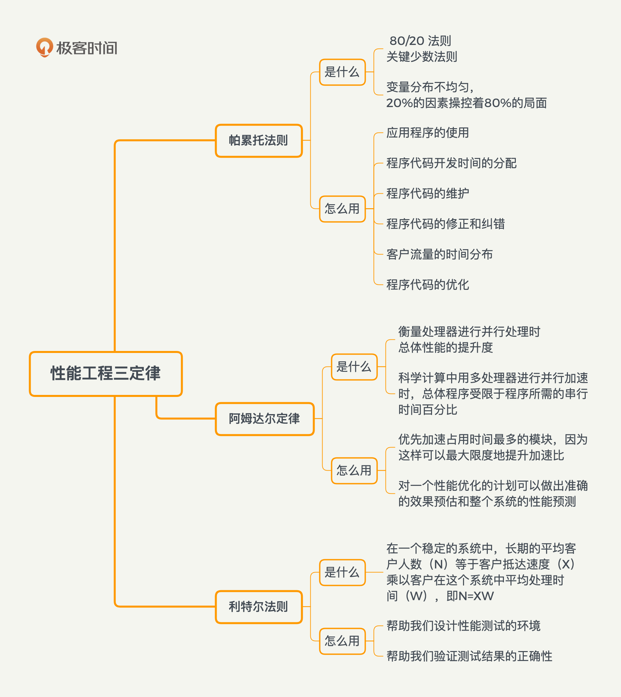
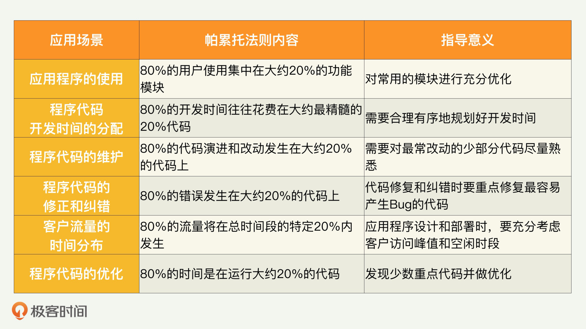
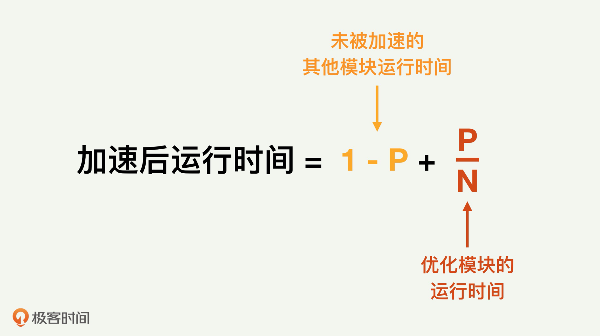
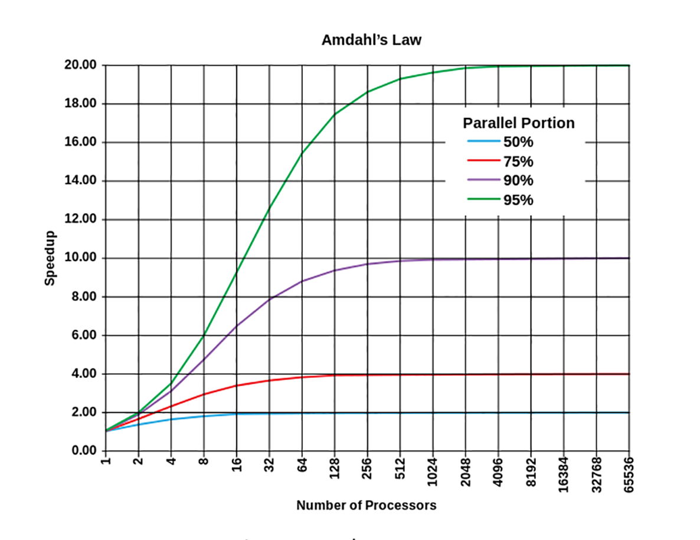
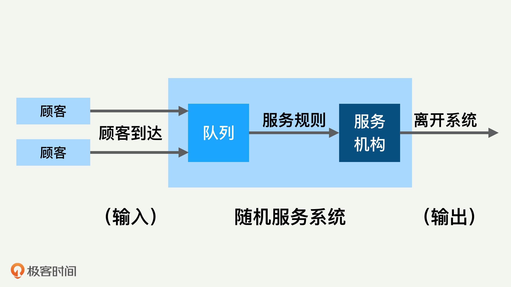

### 性能优化方法
- 解决性能问题的思路：问题→测试→分析→优化→实践
    
#### 性能优化定律
- 
- 帕累托法则： 在很多场景下，大约 20% 的因素操控着 80% 的局面
    - 
- 阿姆达尔定律： 
    - 优先加速占用时间最多的模块，因为这样可以最大限度地提升加速比
    - 对一个性能优化的计划可以做出准确的效果预估和整个系统的性能预测
    - 
    - 
- 利特尔法则
    - 在一个稳定的系统中，长期的平均客户人数（N）等于客户抵达速度（X）乘以客户在这个系统中平均处理时间（W），也就是说 N=XW
    - 帮助我们设计性能测试的环境
    - 帮助我们验证测试结果的正确性
- 概率论
    - 贝叶斯定理（Bayes’ theorem）描述的是在已知一些条件下，某事件的发生概率 
    - 点估计： 平均值、中位数、最大值、最小值、百分位数
    - 方差/标准差： 变量的离散程度   
- 排队论
    - 
         
#### 性能数据分析方法
- 首先需要判断它们的值到底是正常还是不正常
    - 发现不正常的数据，一般就需要做更多的分析和测试来发现原因
- 判断这个指标有没有随着时间或者其他变量的变化而变差（Regression）和变好（Improvement
- 把几个性能指标的数据联系起来一起分析，发现系统的性能瓶颈在哪里 
  

