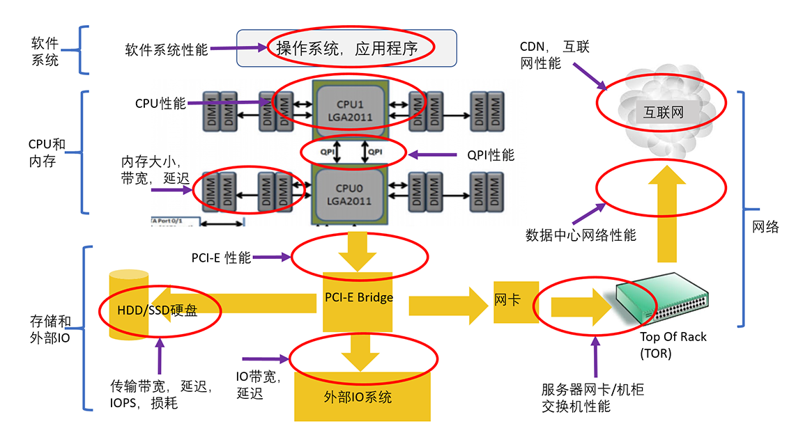
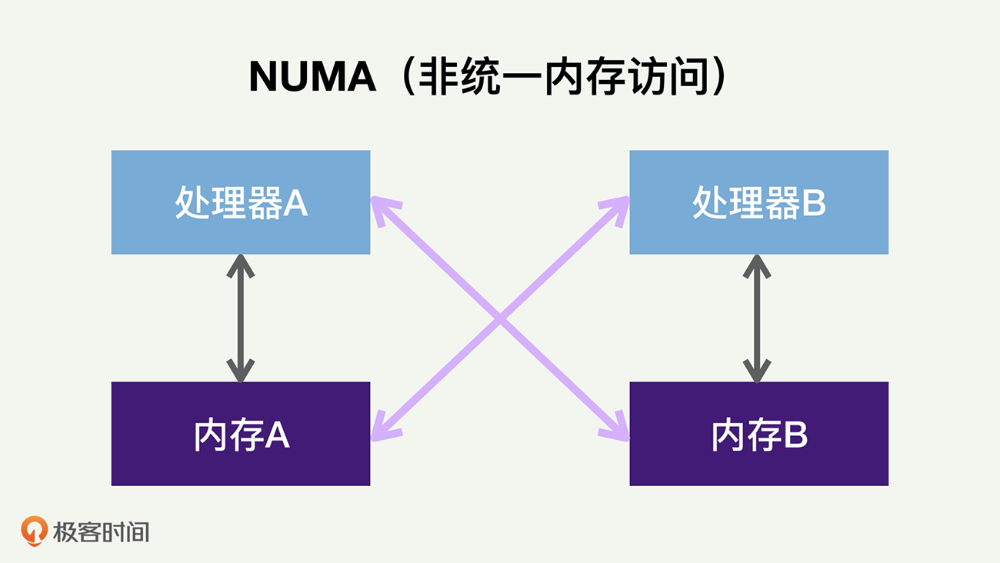
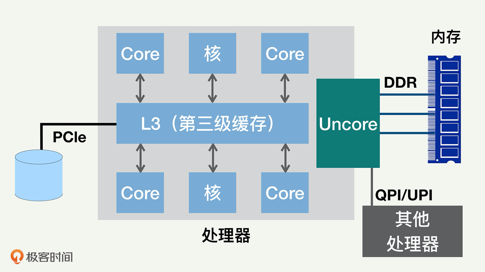
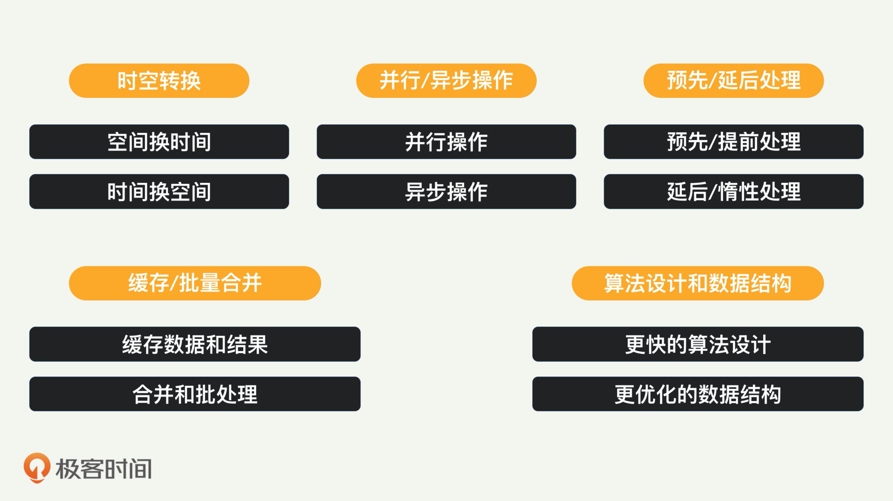

### 性能分析知识要求
#### 性能分析知识概述
- 性能问题归根结底是某个资源不够
- 性能分析的目的，是提供高性能、低延迟、高效率的服务
- 性能分析和优化的第一原则： 谨慎地做性能测试和数据分析
    - 当我们怀疑性能有问题的时候，应该通过合理的测试、日志分析，并作合适的剖析（Profillig），来分析出哪里有问题，从而有的放矢，而不是凭感觉、撞运气
- 性能分析时三个层次的知识
    - 可能的性能瓶颈
    - 每个瓶颈有哪些资源有可能短缺
        - 内存除了内存使用量，还有内存带宽和内存访问延迟
    - 对每个瓶颈的每种资源要了解它和其他模块是如何交互的
        - 对整个系统性能是如何影响的
        - 它的正常值和极限值是多少
        - 如何分析测量
- 优化方式就是什么资源不够就加什么资源，同时尽量降低资源消耗 

#### 性能瓶颈分类
- 系统瓶颈分类
    - 
    - 软件系统：包括操作系统、应用程序、各种类库以及文件系统
    - CPU 和内存：包括 CPU 性能、QPI（QuickPath Interconnect，处理器之间的快速通道互联）和缓存内存
    - 存储和外部 IO：包括处理器的 IO 的接口性能、各种存储系统（尤其是 HDD 和 SSD 性能）
    - 网络：包括服务器到机柜交换机的网络、数据中心的网络、CDN 和互联网
    
#### CPU 知识
 - 普遍采用多处理器（Socket）来提高 CPU 性能，每个处理器都有自己可以直接访问的本地内存（Local Memory）
 - 每个处理器也都可以访问其他处理器的内存，这些内存就相当于是外地 / 远程内存（Remote Memory）
 - 需要访问外地 / 远程内存时候，就需要通过互联通道访问，响应时间就相比本地内存变慢了
     - NUMA（Non-Uniform Memory Access）就此得名
     -  
     - NUMA 架构的主要原因，是提高整个 CPU 的并行处理性能
 - 处理器，内部一般都是多核（Core）架构
 - CPU 的缓存通常分成了三个级别：L1、L2 和 L3
     - L1 和 L2 一般在核的内部
     - 同一个处理器内部的核会共享同一个 L3 缓存
     -     
 - 超线程： 一个核还可以进一步分成几个逻辑核，来执行多个控制流程
     - 一个传统的处理器在线程之间切换，可能需要几万个时钟周期。
     - 一个具有 HT 超线程技术的处理器只需要 1 个时钟周期。因此就大大减小了线程之间切换的成本

#### 内存知识
- 缓存一致性协议： 为了达到数据访问的一致，就需要各个处理器和内核，在访问缓存和写回内存时遵循一些协议

#### 存储知识
- HDD（传统硬盘）的性能
    - 随机 IO 读写延迟就是 8 毫秒左右，IO 带宽大约每秒 100MB，而随机 IOPS 一般是 100 左右
- SSD 的性能
    - 三种类型操作：读取、写入和擦除
    - 组成： 单元（Cell）、页面（Page）、块（Block）
    - 页面也是读写的最小存储单位，块是擦除的基本单位
    - 写入放大： 实际写入 SSD 的物理数据量，有可能是应用层写入数据量的多倍 移动已有数据&垃圾回收
    - 耗损平衡：
    - SSD 提供的更高的 IOPS 和带宽     

#### 网络知识
- 带宽超订： 越往上层，总的带宽越少

#### 性能优化六大原则
- 
- 优先优化最大性能瓶颈： 做性能分析和剖析
- 性能分析要确诊性能问题的根因
    - 考虑优化工作的投入产出比例，就是既考虑成本，也考虑带来的好处
- 性能优化要考虑各种的情况
    - 有一个整体的意识和判断
- 不要做过度的、反常态的优化
    - 过度的优化会增加系统复杂度和维护成本，使得开发和测试周期变长
    - 根据产品的性能要求来决策
- 不要过早做不成熟的优化
    - 如果一个产品已经在业界很成熟，大家非常清楚它的生产环境特点和性能瓶颈，那么优化的重要性可以适当提高 
- 不要做表面的肤浅优化
    - 最好能够自动调整，千万别动不动就手工调优
    
#### 性能优化策略
 -     
 - 用时间换空间
     - 改变应用程序本身的数据结构或者数据格式，减少需要存储的数据的大小
     - 想方设法压缩存在内存中的数据，比如采用某种压缩算法，真正使用时再解压缩
     - 把一些内存数据，存放到外部的、更加便宜的存储系统里面，到需要时再取回来
 - 用空间换时间
     - 负载均衡，就是同时用很多个服务器（空间）来换取延迟的减少（时间）
 - 预先/提前处理
     - CPU硬件预取和软件预取
 - 延后/惰性处理
     - 写时复制: fork 调用/CopyOnWrite 容器       
 - 并行操作
     - 多线程
 - 异步操作
 - 缓存数据
 - 批量合并处理
 - 先进的算法
 - 高效的数据结构
 - 性能优化策略，应该着重服务的水平扩展性，就是通过多线程和多服务器来扩展服务的总体容量
 - 需要尽量地减少跨数据中心和跨机架的网络流量，也就是尽量让网络在本地消化掉
 - 未来是单处理器的天下：在很多生产环境中，内存容量和内存带宽，才是主要的性能瓶颈，而不是 CPU