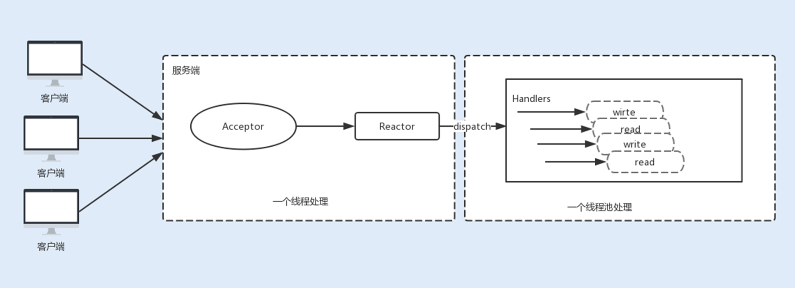

#### 案例： RPC通信优化方法
- 选择合适的通信协议： TCP
- 使用单一长连接
- 优化 Socket 通信 
    - 实现非阻塞 I/O
    - 高效的 Reactor 线程模型
        - 组成： 
            - 事件接收器 Acceptor：主要负责接收请求连接，接收请求后，会将建立的连接注册到分离器中
            - 事件分离器 Reactor： 依赖于循环监听多路复用器 Selector，一旦监听到事件，就会将事件 dispatch 到事件处理器；
            - 事件处理器 Handlers：事件处理器主要是完成相关的事件处理，比如读写 I/O 操作
        - 线程模型：
            - 单线程 Reactor 线程模型
                - 
            - 多线程 Reactor 线程模型
                - 
            - 主从 Reactor 线程模型
                - 
    - 串行设计减少锁竞争，比如： Netty的Pipeline
    - 零拷贝 
    - TCP参数优化
        - TCP_NODELAY： 关闭该算法，优化对于时延敏感的应用场景
        - SO_RCVBUF 和 SO_SNDBUF： 套接字发送缓冲区和接收缓冲区的大小
        - SO_BACKLOG：客户端连接请求缓冲队列的大小
        - SO_KEEPALIVE
- 量身定做报文格式
- 序列化&反序列化
- 调整 Linux 的 TCP 参数设置选项
    - 
  
#### 案例： 双十一抢购性能瓶颈调优
- 业务设计实现
    1. 商品详情页静态化发布到CDN
    2. 抢购倒计时按钮客户端计算，定期从服务端同步时间
    3. 使用Redis分布式锁控制购买资格的发放
    4. 提交订单服务与抢购服务分离（域名+服务器）
    5. 扣除库存使用分布式锁+缓存实现
    6. 订单幂等性校验也使用分布式锁来实现
    7. 以userid 作为key对订单表进行分库分表操作
    8. 用户付款后，支付回调时扣除数据库中库存
    9. 支付回调后，异步调用积分累计、短信通知等服务（MQ实现异步提交）
- 技术实现
    1. 使用限流组件
    2. 获取jedis connection 异常： 使用Redisson插件（netty 非阻塞IO） 替换 Jedis 插件（IO阻塞）
    3. 获取分布式锁服务前增加等待队列，流量消峰
    4. 发送消息前，消息同步写入数据库来避免消息丢失
- 总结
    1. 性能瓶颈在数据库
    
#### 案例：提高LLC（最后一级缓存）的命中率
- 问题： 最后一级缓存（LLC）不命中率太高
- 影响
    - CPU 的速度受影响，内存的访问延迟，是 LLC 的延迟的很多倍（比如五倍）
    - 内存带宽，每一次 LLC 不命中，就会导致一次内存访问
- 监控指令： perf stat -e LLC-loads,LLC-load-misses,LLC-stores,LLC-store-misses
- 优化方案
    - 缩小数据结构： 如果每个数据变小，各级缓存自然就可以缓存更多条数据            
    - 用软件方式来预取数据： 通过合理预测，把以后可能要读取的数据提前取出，放到缓存里面
        - 问题： 这个预测的结果可能会不正确
    - 伪共享缓存： 让每个数据结构变大，牺牲一点存储空间，来解决伪共享缓存的问题
        - 内存缓存系统中，一般是以缓存行（Cache Line）为单位存储的（常见大小64 个字节）
        - 当多线程修改看似互相独立的变量时，如果这些变量共享同一个缓存行，就会在无意中影响彼此的性能

#### 案例：如何提高iTLB（指令地址映射）的命中率
- TLB（转换后备缓冲区)作用: 一个地址映射表，将虚拟内存地址映射到实际的物理地址
- 指令TLB（iTLB) 命中和不命中之间的访问延迟，差异可能是 10 到 100 倍
- 问题：指令地址映射的不命中率太高（High iTLB miss rate），导致程序运行不够快         
- 优化方案：
    - 二进制程序的编译优化
        - 优化编译器选项，来对函数进行重新排序，以便将经常调用的所谓“热函数”放置在一起 --> 提高空间局部性
            - 热区域（Hot Text): 放置频繁访问指令的区域
        - 或者使用 FDO（Feedback-Directed Optimization，就是基于反馈的优化）来减少代码区域的大小
    - 采用大页面的部署优化  
        - 手工：预先为应用程序预留大页面；
        - 自动：使用透明大页面，也就是THP（Transparent Huge Pages）
 - 实现方式：构建了一个流程，来自动化整个过程 ，三大模块：程序剖析（Profiling）、编译链接（Linking）和加载部署（loading）

#### 案例：如何降低SSD峰值延迟
- 问题：SSD 的损耗和 IO 访问延迟偶尔过大
- 写入放大 --> 更快地损耗 SSD 的生命 
- 减少写入放大的措施
    - 保留一定的空闲存储空间： 空间使用率定为 80％至 85％，以保持较低的写入放大率
    - 使用 Trim： 操作系统可以通知 SSD 某些页面存储的数据不再有效了
- Trim 的使用 --> IO 访问可能延迟加大
    - 原因： 
        - 每次 Trim 都会更改映射表，所以对映射表的更改也就实际地记录到 SSD 中
        - 这项操作可能需要花费比较长的时间，比如几毫秒的时间才能完成
- 避免 Trim 带来的延迟的措施
    - 对 Discard 选项本身的调优：discard_max_bytes 对 Discard 进行调优，指定一次 Trim 的最大数据量
    - 使用fstrim命令：有其他的选项，可以根据删除范围或大小来进行微调

#### 案例：比较复杂的 JVM 场景和超大延迟的性能问题
- 服务水平协议： 确保低于 200 毫秒（甚至更短）的延迟
- 问题：JVM Full GC导致的相当大的 STW 暂停
- 原因：JVM 写入GC日志文件时，如果页面处于OS回写状态，则对该页面的write() 必须等待回写完成
- 分析步骤
    - 输出GC日志，找到STW暂停， CPU real 远大于 sys+user
    - 实验室环境中重现该问题
        - 设计的一个简单 Java 程序，程序一直在不断分配对象，当对象数目达到某阈值时，就会删除堆中的对象
        - 为了真实地模拟生产环境，我们在第二种场景中注入后台 IO
    - 监控指标：
        - 总暂停时间，即所有 STW 暂停的总暂停时间
        - 较大的 STW 暂停计数和
    - 分析原因
        - STW 大的暂停是由 GC 日志记录，write() 调用被阻塞导致的
- 解决办法：
    - 减少后台 IO，JVM 应用程序运行的服务器上，不要再部署其他 IO 密集型应用程序
    - 将 GC 日志与其他 IO 分开，将 GC 日志记录到其他地方，比如另外一个文件系统或者磁盘上
        
#### 案例： 避免多个JVM互相影响
- 预分配 JVM 的堆空间
- 保护 JVM 的堆空间不被唤出到外部存储
    - 使用 cgroup 来精确控制要交换的应用程序
    - 系统级别关闭应用程序交换
- 动态调整 THP
    - 当可用内存远远大于应用程序的内存可能占用量大小时，就启用 THP，
    - 否则的话，就关闭 THP

#### 案例：网络传输慢的排查方法
- 可能原因
    - 客户端应用程序的原因
    - 网络的原因
    - 服务器应用程序的原因
- 监控指标：发送方和接收方的传输层上，有关队列大小的信息
- 性能工具：Netstat 和 ss 
- 排查方法
    - 客户端接收数据缓慢 
        - 数据发送方的发送缓冲区满
        - 客户端的接收缓冲区满
    - 数据发送方是瓶颈
        - 服务器端的 SendQ 的值几乎是0
        - 接收端的RecvQ 是零
    - 网络本身是瓶颈
        - 发送端的 SendQ 值不为零
        - 接收端的 RecvQ是零    
-  
    
#### 案例：彻底发挥SSD的潜力
- 设计 SSD 友好的软件带来的好处
    - 提升应用程序等软件的性能；
    - 提高 SSD 的 I/O 效率；
    - 延长 SSD 的寿命。
- SSD友好的软件的设计方式
    - 线程
        - 使用较少的线程来执行大 I/O
        - 使用多个线程执行小的 I/O
        使用多个并发线程来执行 I/O  --> 利用了 SSD 的内部并行性
    - 数据结构
        - 避免就地更新优化： 随机更新和就地更新的吞吐量大体相似
        - 区分热、冷数据
        - 采用紧凑的数据结构
    - IO处理
        - 避免长而繁重的持续写入
        - 避免 SSD 存储太满
    -              
- SSD 和 HDD 迥异的三个关键差异特征
    - SSD 的随机访问与顺序访问具有相同的性能；
    - 需要在块级别进行擦除后才能重写；
    - 内部损耗均衡的机制会导致写入放大
- SSD友好的文件系统
    - 支持 Trim 的新功能的文件系统：Ext4 和 Btrfs
    - 日志结构的数据布局，来容纳 SSD 的“复制 - 修改 - 写入”属性，比如： NVFS（非易失性文件系统）、FFS / JFFS2 和 F2FS
- SSD友好的数据库系统
    - 专门针对 SSD 的数据库，例如 AreoSpike
    - HDD 和 SSD 混合的数据库，一般是使用 SSD 来缓存数据
- SSD友好的数据基础架构层
    - 本地 SSD 变得比远程内存访问更为高效
    - 尽可能与应用程序共同分配数据，以避免额外的节点和网络的限制，从而降低系统的复杂性和成本
    
#### java性能优化技巧
- 代码性能问题会随着耗尽系统资源而暴露出来
- 技巧： 使用intern减少重复字符串占用的空间
- 技巧： 将方法里面的业务代码全部注释，留一个空方法，区分是框架性能问题，还是业务代码性能问题
- 问题： 复杂的正则表达式系统性能开销大
- 问题：不要使用java默认的序列化机制
- 技巧： java stream 不能提高性能

#### 使用缓存优化性能
- 进程内缓存
    - 优点： 速度快
    - 缺点： 服务间缓存难同步；内存容量有限
    - sample： 1） Guava Cache 2） Ehcache
- 分布式缓存
    - 数据一致性要求比较严格
    - sample ：Redis
- 可能出现的问题:
    - 缓存数据与数据库中不一致
        - 先删缓存，后删数据库： 如果删除缓存后，有其他客户端读取数据，则会出现脏数据
            - 线程安全队列辅助判断是否需要从数据库读数据
        - 先删数据库，后删缓存，如果缓存删除失败，则出现脏数据
        - 变化频繁且对一致性要求高的业务，不使用缓存
    - 缓存穿透、缓存击穿、缓存雪崩
        - 缓存穿透：使用布隆过滤器，查询key值是否一定不存在（不适合key值会被删除的场景）
        - 缓存击穿：使用锁控制同一个key，同一时刻只有一个线程更新缓存数据，其他线程阻塞等待
        - 缓存雪崩：分散过期时间&分布式集群
        
#### 分布式事务调优
- XA规范/两阶段提交（2PC)/三阶段提交（3PC）的缺点
    - 事务管理器存在单点问题
    - 提交阶段通知消息可能丢失，造成数据不一致
- 事务补偿机制（TCC)
    - 三个阶段 try、confirm、cancel
    
    - confirm、cancel阶段出现异常，事务管理器会不断重试
    - 缺点
        - 业务侵入性非常大
        - 必须实现try、confirm、cancel方法，每个方法考虑幂等性
    - 优点： 性能较好，最常用的分布式事务解决方案
    - TODO 

#### 分布式锁实现方式及性能对比
- 数据库实现
    - 三个步骤
        1. 创建数据表
        2. 查询记录是否存在： select id from `order` where key ='' for update
        3. 查询、插入在一个事务中
    - 存在性能瓶颈，请求量大会出现事务中断
    - 可能存在锁没有释放的场景，引发死锁问题
- Zookeeper 实现
    - 实现方法
        1. 创建一个持久性节点做为父节点
        2. 访问共享资源时，在父节点下创建临时顺序子节点，名称为： 子节点名称+父节点名称+顺序号
        3. 对子节点进行排序，如果新建子节点时最小节点，获得锁；否则阻塞
        4. 阻塞时候去上一个顺序号的节点，注册监听事件
        5. 释放锁时，删除子节点；监听事件通知程序获得锁
    
    - 框架： Curator
    - 优点：可靠性好，在性能要求不太高的场景下，优先选用
    - 缺点：性能存在问题
- Redis
    - 优点： 性能最好
    - 类库： redisson
<pre>
    long waitTimeout = 10;
    long leaseTime = 1;
    RLock lock1 = redissonClient1.getLock("lock1");
    RLock lock2 = redissonClient2.getLock("lock2");
    RLock lock3 = redissonClient3.getLock("lock3");
    
    RedissonRedLock redLock = new RedissonRedLock(lock1, lock2, lock3);
    // 同时加锁：lock1 lock2 lock3
    // 红锁在大部分节点上加锁成功就算成功，且设置总超时时间以及单个节点超时时间
    redLock.trylock(waitTimeout,leaseTime,TimeUnit.SECONDS);
    ...
    redLock.unlock();
</pre>

#### TPS趋势分析
- 在一个既定场景、既定数据、既定环境的压力场景中，我们一定要拿到这样趋势的 TPS 和 RT 曲线
    - 
- 做性能分析一定要分析曲线的趋势，通过趋势的合理性来判断下一步要做的事情
- 经常会看到 TPS 特别混乱的曲线，抖动幅度非常大，这种情况是完全不合理的，此时一定要记得降低压力线程
- 正常情况下的性能曲线
    - 
    - 