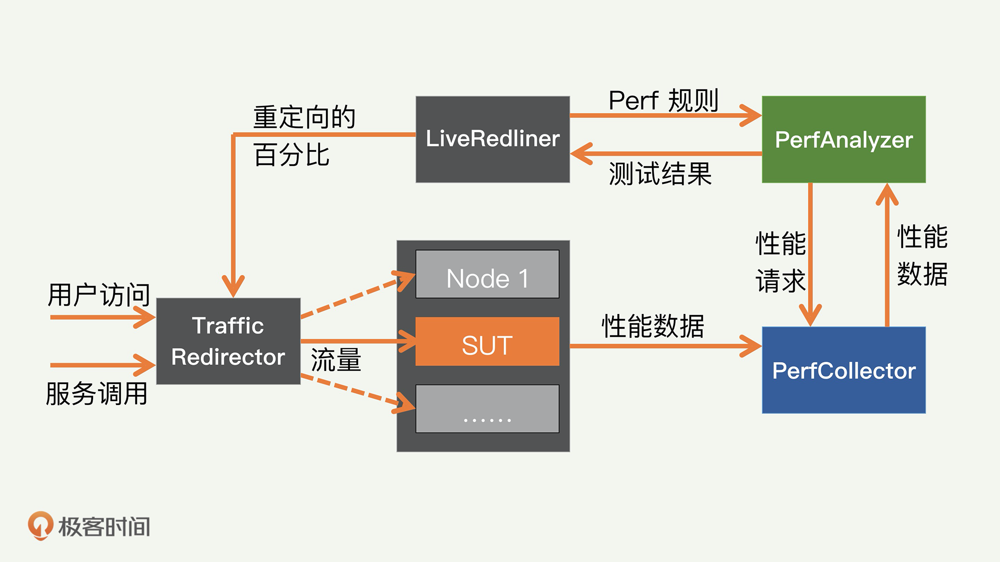

### 性能工程
- 容量测试: 确定每台单独的服务器可以支撑多少服务流量
    - 在生产环境中进行真实场景的压力测试，获取服务器的最大容量  
        - 必要性： 人工合成的流量负载，会非常不准确
    - 挑战：
        - 需要设计一个控制重定向流量的机制，能够根据其他一些参数，来调整重定向的流量多少
        - 重定向生产流量可能会影响真正的客户
            - 系统里面必须有一个模块，来不断地监测客户的性能；一旦到达临界点，就停止继续加压的操作，甚至适当减压
        - 对于测试时间的控制
    - 合理方案的设计原则
        - 要使用实时流量以确保准确性。
        - 尽量不影响生产流量，这就需要实时的监测和反馈模块。
        - 可以定制重定向等行为规则；对不同的服务和不同的场景的测试，各种性能指标和阈值都会不同。
        - 能自动终止测试，并把测试环境复位，尽量减少人工干预。
        - 支持基于日历和事件的自动触发和调度
    - LinkedIn的解决方案： RedLiner 
        - 固定一个生产环境中的 SUT，这个 SUT 包括服务器和上面运行的被测服务
        - 不断地把其他服务器上的流量，重定向到这个 SUT 服务器上面
        - 直到客户请求的性能差到一个定好的阈值，流量重定向才会停止
        - 此时获得的容量结果就是 SUT 服务器的最大容量
        - 
- 规划和控制数据库的复制延迟大小
    - 数据库的复制延迟： 一条信息从源头数据库传递复制到下游数据库时经过的延迟
    - 数据的传输复制模块，其实是一个有无限缓冲的先进先出队列
    - 复制延迟的SLA： 所有事件的“最长”等待时间
    - 容量规划的变量
        - 用户流量
        - 复制模块的吞吐量
        - 复制的延迟
- 容量规划
    - 容量规划的目的
        - 保证公司的正常运营和业务增长，及时地提供足够的容量，来满足未来所需
        - 希望空闲的容量越少越好，节约公司的运营成本
    - 容量规划的过程
        - 首先是容量测试来决定单位容量的负载能力；
        - 同时确定公司的业务增长需求，并且获取公司的运营预算。
        - 然后集成其他的考虑因素（包括时间、地域、灾难恢复等），做出合理的规划和决策。
        - 最后根据决策结果，进行容量订购
- 服务效率提升
    - 分类
        - 软件效率（Software Efficiency）
        - 服务架构效率（Service Architecture Efficiency）
            - 合理借助其他服务来优化，比如： 数据库和缓存 替换纯数据库的架构
        - 服务部署效率（Service Deployment Efficiency）
        - 跨平台效率（Cross-platform Efficiency）
        - 硬件效率（Hardware Efficiency）
        - 容量组织效率（Capacity Orgnization Efficiency）
        - 容量资源回收（Capacity Resource Reclamation）
        - 用户效率（User Efficiency）