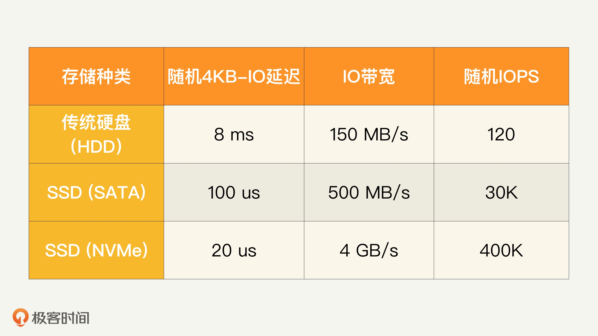
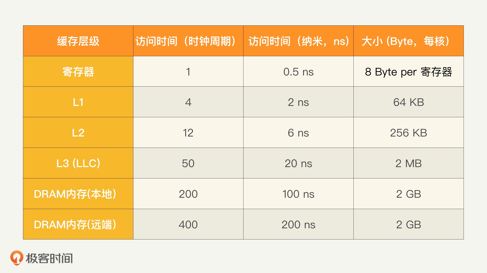
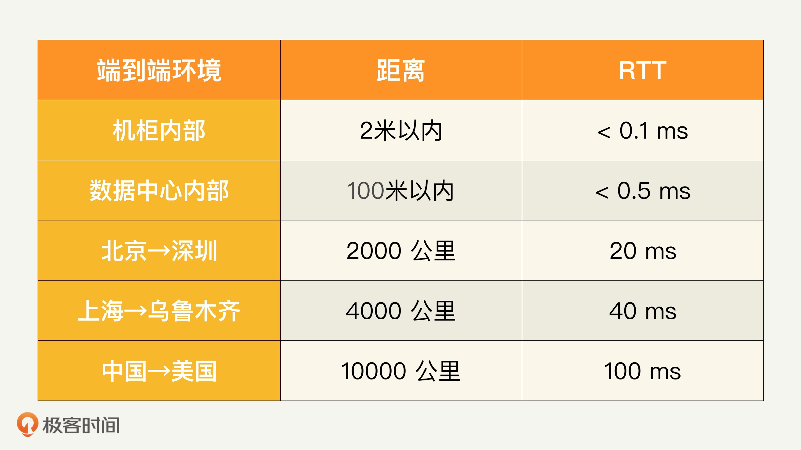

### 性能分析知识要求
#### 性能分析知识概述
- 性能问题归根结底是某个资源不够
- 性能分析的目的，是提供高性能、低延迟、高效率的服务
- 性能分析和优化的第一原则： 谨慎地做性能测试和数据分析
    - 当我们怀疑性能有问题的时候，应该通过合理的测试、日志分析，并作合适的剖析（Profillig），来分析出哪里有问题，从而有的放矢，而不是凭感觉、撞运气
- 性能分析时三个层次的知识
    - 可能的性能瓶颈
    - 每个瓶颈有哪些资源有可能短缺
        - 内存除了内存使用量，还有内存带宽和内存访问延迟
    - 对每个瓶颈的每种资源要了解它和其他模块是如何交互的
        - 对整个系统性能是如何影响的
        - 它的正常值和极限值是多少
        - 如何分析测量
- 优化方式就是什么资源不够就加什么资源，同时尽量降低资源消耗 

#### 性能瓶颈分类
- 系统瓶颈分类
    - 
    - 软件系统：包括操作系统、应用程序、各种类库以及文件系统
    - CPU 和内存：包括 CPU 性能、QPI（QuickPath Interconnect，处理器之间的快速通道互联）和缓存内存
    - 存储和外部 IO：包括处理器的 IO 的接口性能、各种存储系统（尤其是 HDD 和 SSD 性能）
    - 网络：包括服务器到机柜交换机的网络、数据中心的网络、CDN 和互联网
    
#### CPU 知识
 - 普遍采用多处理器（Socket）来提高 CPU 性能，每个处理器都有自己可以直接访问的本地内存（Local Memory）
 - 每个处理器也都可以访问其他处理器的内存，这些内存就相当于是外地 / 远程内存（Remote Memory）
 - 需要访问外地 / 远程内存时候，就需要通过互联通道访问，响应时间就相比本地内存变慢了
     - NUMA（Non-Uniform Memory Access）就此得名
     -  
     - NUMA 架构的主要原因，是提高整个 CPU 的并行处理性能
 - 处理器，内部一般都是多核（Core）架构
 - CPU 的缓存通常分成了三个级别：L1、L2 和 L3
     - L1 和 L2 一般在核的内部
     - 同一个处理器内部的核会共享同一个 L3 缓存
     -     
 - 超线程： 一个核还可以进一步分成几个逻辑核，来执行多个控制流程
     - 一个传统的处理器在线程之间切换，可能需要几万个时钟周期。
     - 一个具有 HT 超线程技术的处理器只需要 1 个时钟周期。因此就大大减小了线程之间切换的成本

#### 内存知识
- 缓存一致性协议： 为了达到数据访问的一致，就需要各个处理器和内核，在访问缓存和写回内存时遵循一些协议

#### 存储知识
- HDD（传统硬盘）的性能
    - 随机 IO 读写延迟就是 8 毫秒左右，IO 带宽大约每秒 100MB，而随机 IOPS 一般是 100 左右
- SSD 的性能
    - 三种类型操作：读取、写入和擦除
    - 组成： 单元（Cell）、页面（Page）、块（Block）
    - 页面也是读写的最小存储单位，块是擦除的基本单位
    - 写入放大： 实际写入 SSD 的物理数据量，有可能是应用层写入数据量的多倍 移动已有数据&垃圾回收
    - 耗损平衡：
    - SSD 提供的更高的 IOPS 和带宽     

#### 网络知识
- 带宽超订： 越往上层，总的带宽越少

### 性能指标
#### 资源类指标
- 资源利用率
    - 容量系统
    - 意外事件的缓冲（Buffer）和灾难恢复（Disaster Recovery, or DR）
- 资源分类    
    - CPU：  CPU 的负载情况和使用率、系统 CPU、用户 CPU、IO 等待 、软中断、硬中断、上下文切换
    - 内存： 内存大小、内存访问延迟和内存带宽
    - 存储IO： IOPS、访问延迟、吞吐率/带宽
    - 网络：   可用性、响应时间、网络带宽容量、网络吞吐量、网络利用率
    - 数据库
    - 锁竞争
    - 异常 

#### 性能基准数据
- 硬盘
    - 
- CPU & 内存
    -         
- 操作系统
    - 指令分支延迟    十几个时钟周期，10 纳秒左右
    - 互斥加锁和解锁  几十个时钟周期，10 纳秒以上。  
    - 上下文切换      几千个时钟周期，1 微秒（1us）级别
- 网络相关
    - 

#### 表现类指标
- 服务响应时间
    - 客户发出的请求被成功服务的时间,要考虑端到端的延迟度量（End To End, or E2E
    - 终端客户
    - 要同时考虑平均值、中位数和几个高端的百分位数，比如 99 百分位
    - 根据系统的延迟可接受大小，我们需要控制负载流量，以免访问延迟过大而影响客户体
- 服务吞吐量/吞吐率
    - 吞吐率指的是单位时间（比如每秒钟）可以成功处理的请求数或任务数
    - 业务平台
    - 峰值极限: 超过这个峰值极限，系统就会超载，除了服务延迟超标，还会造成一系列的性能问题
- 服务错误率
- 扩展性（Scalability）： 系统在高压的情况下能不能正常处理请求

### 性能工具
#### CPU 的性能工具
- Top
- uptime
- mpstat
- pidstat 
- vmstat
- perf        

#### 内存性能工具
- free
- vmstat
- /proc/meminfo

#### 存储性能工具
- IOMeter
- IOZone
- iostat

#### 网络工具
- Netperf
- Iperf
- Netstat
- Traceroute

#### 代码微基准测试工具（JMH） 
- 代码微基准测试的工具套件
- 使用方法
    - 引入 jmh-core、jmh-generator-annprocess
    - 注解 BenchmarkMode： 使用模式，包括吞吐量、平均执行时间等
    - 注解 Warmup： 预热次数
    - 注解 Measurement：执行次数&执行时长
    - 注解 Threads： 同时执行的线程数
    - 注解 Fork： 每个方法启动的进程数
    - 注解 OutputTimeUnit： 统计结果的时间单位
    - 注解 Benchmark： 标记需要测试的方法
    - 注解 CompilerControl: 控制是否支持内联
    - 注解 OperationsPerInvocation ： 对批量执行的方法调用次数修正，比如调用1次批量方法，相当于执行20次单次调用
- 注意事项： 避免虚拟机优化导致方法内容没有执行（Dead Code）
    - 测试最好提供一个返回值，避免jit优化掉代码导致失真
    - 可以增加一个空方法的基准测试，如果测试结果数据与基准代码接近，表示代码被优化掉了