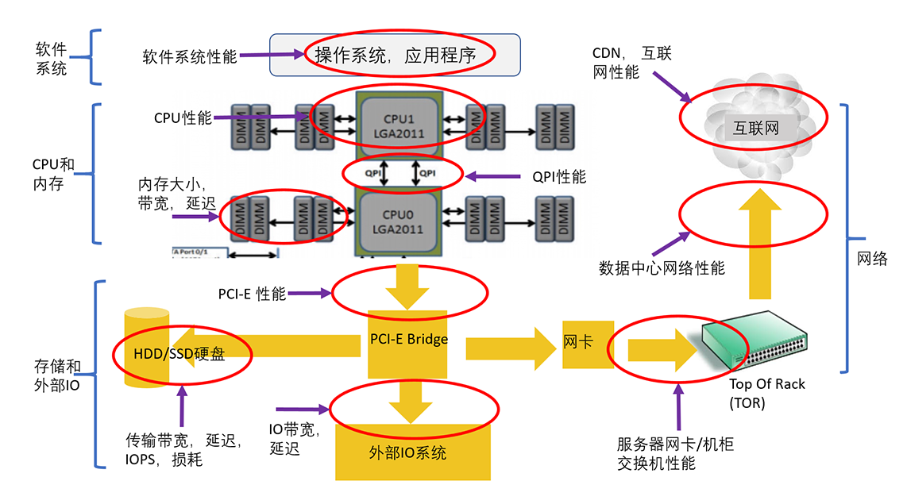
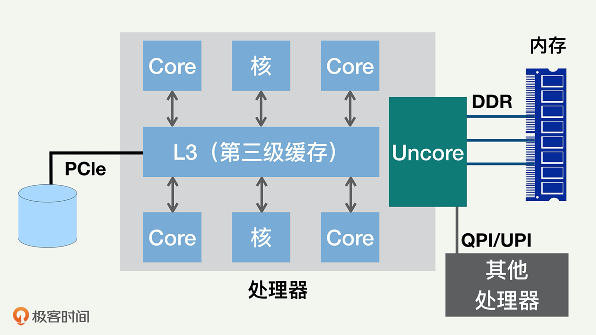
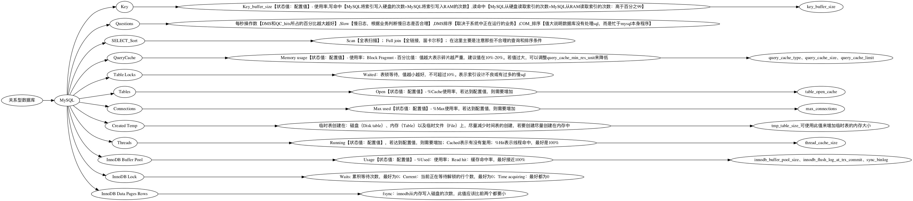
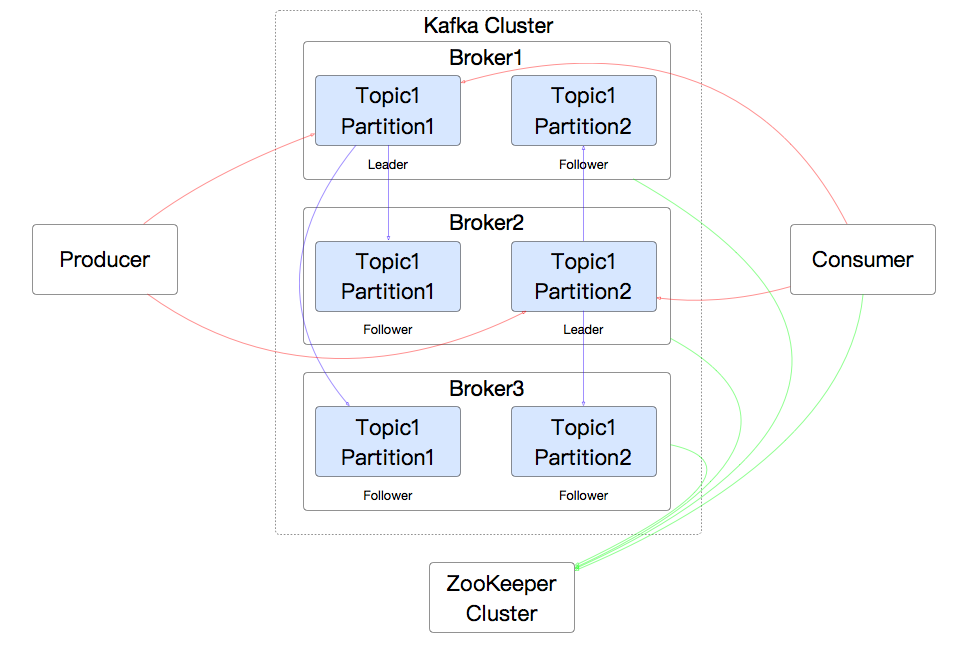

### 性能分析知识要求
#### 性能分析知识概述
- 性能问题归根结底是某个资源不够
- 性能分析的目的，是提供高性能、低延迟、高效率的服务
- 性能分析和优化的第一原则： 谨慎地做性能测试和数据分析
    - 当我们怀疑性能有问题的时候，应该通过合理的测试、日志分析，并作合适的剖析（Profillig），来分析出哪里有问题，从而有的放矢，而不是凭感觉、撞运气
- 性能分析时三个层次的知识
    - 可能的性能瓶颈
    - 每个瓶颈有哪些资源有可能短缺
        - 内存除了内存使用量，还有内存带宽和内存访问延迟
    - 对每个瓶颈的每种资源要了解它和其他模块是如何交互的
        - 对整个系统性能是如何影响的
        - 它的正常值和极限值是多少
        - 如何分析测量
- 优化方式就是什么资源不够就加什么资源，同时尽量降低资源消耗 

#### 性能瓶颈分类
- 系统瓶颈分类
    - 
    - 软件系统：包括操作系统、应用程序、各种类库以及文件系统
    - CPU 和内存：包括 CPU 性能、QPI（QuickPath Interconnect，处理器之间的快速通道互联）和缓存内存
    - 存储和外部 IO：包括处理器的 IO 的接口性能、各种存储系统（尤其是 HDD 和 SSD 性能）
    - 网络：包括服务器到机柜交换机的网络、数据中心的网络、CDN 和互联网
    
#### CPU 知识
 - 普遍采用多处理器（Socket）来提高 CPU 性能，每个处理器都有自己可以直接访问的本地内存（Local Memory）
 - 每个处理器也都可以访问其他处理器的内存，这些内存就相当于是外地 / 远程内存（Remote Memory）
 - 需要访问外地 / 远程内存时候，就需要通过互联通道访问，响应时间就相比本地内存变慢了
     - NUMA（Non-Uniform Memory Access）就此得名
     -  
     - NUMA 架构的主要原因，是提高整个 CPU 的并行处理性能
 - 处理器，内部一般都是多核（Core）架构
 - CPU 的缓存通常分成了三个级别：L1、L2 和 L3
     - L1 和 L2 一般在核的内部
     - 同一个处理器内部的核会共享同一个 L3 缓存
     -     
 - 超线程： 一个核还可以进一步分成几个逻辑核，来执行多个控制流程
     - 一个传统的处理器在线程之间切换，可能需要几万个时钟周期。
     - 一个具有 HT 超线程技术的处理器只需要 1 个时钟周期。因此就大大减小了线程之间切换的成本

#### 内存知识
- 缓存一致性协议： 为了达到数据访问的一致，就需要各个处理器和内核，在访问缓存和写回内存时遵循一些协议

#### 存储知识
- HDD（传统硬盘）的性能
    - 随机 IO 读写延迟就是 8 毫秒左右，IO 带宽大约每秒 100MB，而随机 IOPS 一般是 100 左右
- SSD 的性能
    - 三种类型操作：读取、写入和擦除
    - 组成： 单元（Cell）、页面（Page）、块（Block）
    - 页面也是读写的最小存储单位，块是擦除的基本单位
    - 写入放大： 实际写入 SSD 的物理数据量，有可能是应用层写入数据量的多倍 移动已有数据&垃圾回收
    - 耗损平衡：
    - SSD 提供的更高的 IOPS 和带宽     

#### 网络知识
- 带宽超订： 越往上层，总的带宽越少

### 性能指标
#### 资源类指标
- 资源利用率
    - 容量系统
    - 意外事件的缓冲（Buffer）和灾难恢复（Disaster Recovery, or DR）
- 资源分类    
    - CPU：  CPU 的负载情况和使用率、系统 CPU、用户 CPU、IO 等待 、软中断、硬中断、上下文切换
    - 内存： 内存大小、内存访问延迟和内存带宽
    - 存储IO： IOPS、访问延迟、吞吐率/带宽
    - 网络：   可用性、响应时间、网络带宽容量、网络吞吐量、网络利用率
    - 数据库
    - 锁竞争
    - 异常 

#### 性能基准数据
- 硬盘
    - 
- CPU & 内存
    -         
- 操作系统
    - 指令分支延迟    十几个时钟周期，10 纳秒左右
    - 互斥加锁和解锁  几十个时钟周期，10 纳秒以上。  
    - 上下文切换      几千个时钟周期，1 微秒（1us）级别
- 网络相关
    - 

#### 表现类指标
- 服务响应时间
    - 客户发出的请求被成功服务的时间,要考虑端到端的延迟度量（End To End, or E2E
    - 终端客户
    - 要同时考虑平均值、中位数和几个高端的百分位数，比如 99 百分位
    - 根据系统的延迟可接受大小，我们需要控制负载流量，以免访问延迟过大而影响客户体
- 服务吞吐量/吞吐率
    - 吞吐率指的是单位时间（比如每秒钟）可以成功处理的请求数或任务数
    - 业务平台
    - 峰值极限: 超过这个峰值极限，系统就会超载，除了服务延迟超标，还会造成一系列的性能问题
- 服务错误率
- 扩展性（Scalability）： 系统在高压的情况下能不能正常处理请求

#### Grafana+Prometheus+Exporters
- 架构图
    - 
- 组件
    - exporter: 监控收集器，它可以获取的监控数据
    - Prometheus
    - Grafana
    
#### 操作系统级监控及常用计数器

- 需要监控的模块: CPU、I/O、Memory、Network、System、Swap
   

- CPU常见问题
    - 用户态CPU高    
        
    - IO wait 高
        
    - 系统CPU高
        
    - 软中断消耗的CPU高
        
- I/O 常用计数器
    - iostat工具: 
        - w_await表示写入的平均响应时间；
        - r_await表示读取的平均响应时间；
        - r/s表示每秒读取次数；
        - w/s表示每秒写入次数
    - iotop 分进程查看
        - Total 的值显示的是用户态进程与内核态进程之间的速度，
        - Actual 显示的是内核块设备子系统与硬件之间的速度
- Memory
    - free 命令： total肯定是要优先看的，其次是available
    - dmesg日志: 操作系统就会调用OOM Killer，这个进程会强制杀死消耗内存大的应用,操作结果写入日志
    - nmon
    - cat/proc/meminfo
- NetWork
    
    - Recv_Q 和 Send_Q :
        
        
        
    - 半连接队列和全连接队列            
        - 半连接队列满了，syn包都被扔掉了
            - 指令： netstat -s |grep -i listen
        - 全连接队列已经满
            - 指令： netstat -s |grep overflow
        - 只有一种情况要处理TIME_WAIT，那就是端口不够用的时候
- 系统
    - in(interrupts:中断)
    - cs(context switch：上下文切换)
- Swap
    - 在性能测试和分析中，建议直接把它关了
    
#### 代码级监控及常用计数器
- 分析思路
    
- 两个关键点
    - 执行时间: jvisualvm -> Sampler -> CPU
    - 执行空间
        - jvm内存场景
            - 正常内存的场景: 回收健康（无内存泄漏） , GC 够快<-垃圾回收CPU使用率低
            - 内存分配过多的场景: 已使用内存量远小于分配内存量
            - 内存不够用的场景: 内存使用率过高
            - 内存泄漏的场景: 年轻代、年老代全满了,Yonug GC停止，Full GC尝试回收，未能成功
        - 查找内存过多
            - 最好是看自己代码调用的对象的内存占用大小增量
                - 1) 先过滤下我们自己的包
                - 2) 点击一下 Deltas
            - jmap 做heapdump,然后用 MAT 打开
           
#### Tomcat 监控及常用计数器

- 最好就是用官方给的默认运行模式（NIO）
- 日志中输出:请求量、请求时间、响应时间，配置方法: 
    - pattern="%h %l %u %t "%r" %s %b %D %F" 
    - %D 就是请求时间
    - %F 是响应时间
- SSL 证书对性能有明显的影响了，最大的影响到 18.93%
- 禁用 AJP 确实性能会高一点，在这个场景中最高的时候，同压力线程下，性能高出近 20%  
      
#### 数据库级监控及常用计数器    

- MySQL 两个schema : information_schema和performance_schema
- 工具
    - mysqlreport
        
    - pt-query-digest: 定向抓取 SQL
        - 对于大部分实时的业务，一个 SQL 执行的平均时间指标定在 100ms 都多了
    - profiling 
        - MySQL 的profiling在session级生效
        - 步骤一 ：set profiling=1; //这一步是为了打开profiling功能
        - 步骤二 ：执行语句 //执行你从慢日志中看到的语句
        - 步骤三 ：show profiles; //这一步是为了查找步骤二中执行的语句的ID
        - 步骤四 ：show profile all for query id;            
    - mysql_exportor+Prometheus+Grafana
    
#### 消息队列级监控及常用计数器

    
#### 链路级监控及常用计数器解析（SkyWalking）
- 微服务架构的系统中，没有好的链路监控工具，对性能分析来说就是灾难
- 链路监控工具，称之为 APM

- 使用APM工具要实现的功能
    - 查看微服务节点的健康状态。
    - 判断响应时间的消耗点。
    - 通过我们前文中提到的定向监控手段进行详细地问题定位，细化到组件的配置、代码行和 SQL 层级。
    - 最后根据定位的根本原因，提出具体的性能瓶颈解决方案

#### 对一个组件不了解的时候，如何通过自己的基础知识来做一个非常合理的分析
- 先了解这个组件的基本知识：包括架构、实现原理等信息
- 再整理出这个组件的配置参数
- 找到合适的全局监控工具
- 做压力测试时给出明显的判断

### 性能工具
#### CPU 的性能工具
- Top
- uptime
- mpstat
- pidstat 
- vmstat
- perf        

#### 内存性能工具
- free
- vmstat
- /proc/meminfo

#### 存储性能工具
- IOMeter
- IOZone
- iostat

#### 网络工具
- Netperf
- Iperf
- Netstat
- Traceroute

#### 代码微基准测试工具（JMH） 
- 代码微基准测试的工具套件
- 使用方法
    - 引入 jmh-core、jmh-generator-annprocess
    - 注解 BenchmarkMode： 使用模式，包括吞吐量、平均执行时间等
    - 注解 Warmup： 预热次数
    - 注解 Measurement：执行次数&执行时长
    - 注解 Threads： 同时执行的线程数
    - 注解 Fork： 每个方法启动的进程数
    - 注解 OutputTimeUnit： 统计结果的时间单位
    - 注解 Benchmark： 标记需要测试的方法
    - 注解 CompilerControl: 控制是否支持内联
    - 注解 OperationsPerInvocation ： 对批量执行的方法调用次数修正，比如调用1次批量方法，相当于执行20次单次调用
- 注意事项： 避免虚拟机优化导致方法内容没有执行（Dead Code）
    - 测试最好提供一个返回值，避免jit优化掉代码导致失真
    - 可以增加一个空方法的基准测试，如果测试结果数据与基准代码接近，表示代码被优化掉了