### 性能测试
#### 性能测试目的 
- 确保软件应用程序在一定的负载流量下运行良好
- 目标： 发现和性能相关的各种问题和性能瓶颈，从而进一步去消除错误和性能瓶颈
- 测试的目的：
    - 测量服务速度（Speed）： 延迟和吞吐率
    - 测量可扩展性（Scalability）： 
    - 测量稳定性（Stability）
    - 测量性能瓶颈（Performance Bottleneck）
- 测试的负载流量
    - 低流量、中等流量和高流量 --> 相对于生产环境中的流量
    - 负载变化的速度
    
#### 测试的分类
- 耐力测试 （偏重点是测试时间）    
    - 长时间测试具有预期负载量的系统，以验证系统的行为是否正常
    - 暴露某些不易重现的问题，如内存问题、系统故障或其他随机问题 
- 基准测试/性能回归测试
    - 保证前后测试环境的一致，比如负载流量的特征和大小
- 负载测试（Load Testing）
    - 验证被测试系统或者程序是否可以处理预期的负载流量
    - 并验证正常和峰值负载条件下的系统和程序行为
- 断点测试（Breakpoint Testing）
    - 随着时间的推移而增大流量负载，同时监视系统的预定故障条件
    - 用来确定系统将达到其所需规范或服务水平协议的最大容量
- 尖峰测试（Spike Testing）
    - 确定系统在负载（比如用户请求数）突然变化时的系统行为
    - 核心是负载变化的突然性，所以也算是一种压力测试
- 可扩展性/可伸缩性测试
    - 确定一个程序和系统的非功能性特征能不能在变化的环境里合理扩展
- 容量测试（Capacity Testing）
    - 确定一个单位容量能够支持的最大负载   
    - 容量测试至少包含三个部分：可调节的流量负载、性能的测量、可以接受的性能指标。
- 瓶颈测试（Bottleneck Testing）
    - 目的是找到被测试系统和程序的最制约的资源类型（比如 CPU 或者存储）
    
#### 性能测试方法
- 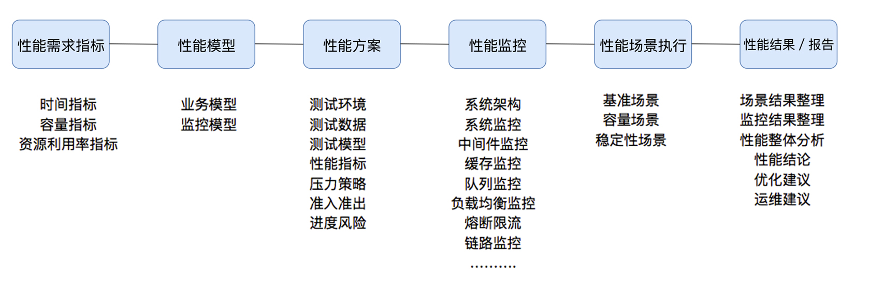
- 指标：时间指标、容量指标和资源利用率指标
    - 
- 模型：
    - 是真实场景的抽象，可以告诉性能测试人员，业务模型是什么样子        
    - 方法1：根据生产环境的统计信息做业务比例的统计，然后设定到压力工具中
    - 方法2：直接在生产环境中做流量复制的方式或压力工具直接对生产环境发起压力的方式做压力测试
- 方案
    - 测试环境
    - 测试数据
    - 测试模型
    - 性能指标
    - 压力策略
    - 准入准出
    - 进度风险
- 监控
    - 有分层、分段的能力
    - 有全局监控、定向监控的能力
- 有预定的条件
    - 软硬件环境
    - 测试数据
    - 测试执行策略
    - 压力补偿
    
#### 性能测试规划和执行
- 首先搞清楚被测试的实体，也就是 SUT（System Under Test），对应的性能指标和度量，以及期望的结果
    - 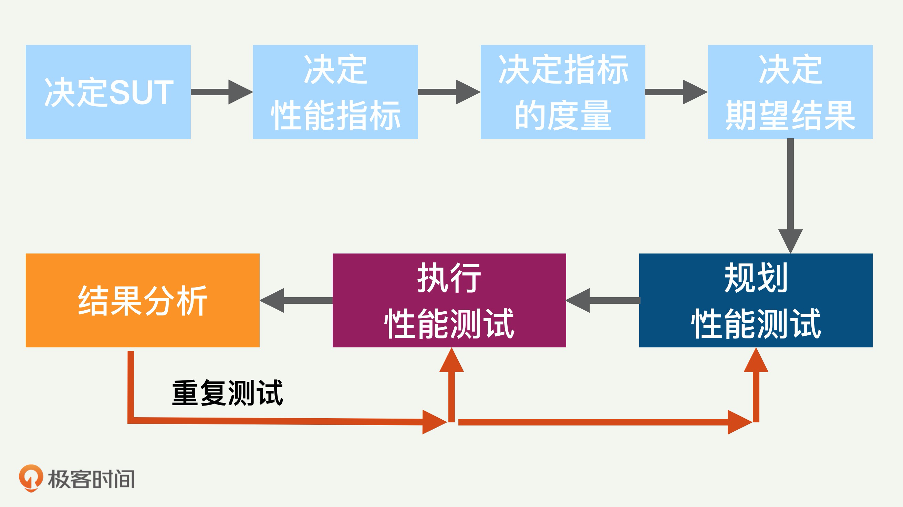
    - 测试过程中，除了 SUT 本身，其他所有的模块和构件在整个性能测试的过程中都不能有任何性能瓶颈
- 测试规划中需要考虑的问题
    - 负载流量的特征： 需要决定是用真正的生产环境的负载还是仿真的负载
    - 负载如何注入
        - 是用实时的流量呢，还是用过去捕捉的流量来重新注入？
        - 流量的大小，是完全模拟生产环境呢，还是加大负载。
        - 如果不使用实时生产流量，那么如何注入呢
    - 测试的数据： 用真正的用户数据还是仿真的数据
    - 黑盒还是白盒测试
        - 白盒： 允许改变 SUT，比如在程序中间输出更多的性能日志信息等
    - 测试的工具
    - 测试的环境
- 测试执行时需要考虑的问题
    - 测试结果的可重复性非常重要
    - 分步进行：把复杂的测试验证过程分成几步，一次验证一步，最后一步是整个完整的测试
    - 先短时间测试，再长时间测试
    - 模拟测试：在实际使用负载测试之前，先执行简单的负载测试以检查各种工具的正确性      

#### 性能场景设计
- 定义
    - 在既定的环境（包括动态扩展等策略）、既定的数据（包括场景执行中的数据变化）既定的执行策略、既定的监控之下，
    - 执行性能脚本，同时观察系统各层级的性能状态参数变化，并实时判断分析场景是否符合预期
- 场景分类
    - 基准性能场景：这里要做的是单交易的容量
    - 容量性能场景
    - 稳定性性能场景
    - 异常性能场景
    
-设计方法
    1) 列出自己要测试的业务比例、业务目标 TPS 和响应时间指标
        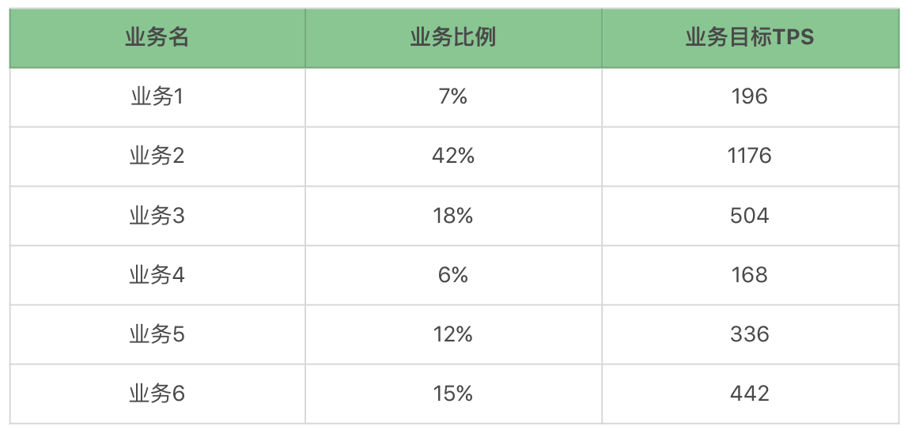
        - 获取业务比例的方法
            - 首先从生产环境取出数据，粒度到秒级，取出所有业务的交易量数据,数据长度为1个月
            - 按日统计业务量，找到业务系统的峰值数据
            - 取出业务量最大的一天，按照小时统计业务量，生成多个场景
                - 通用业务场景模型： 使用全天数据，计算各业务量的比例
                - 峰值（小时）： 将业务量峰值小时的数据取出，计算各业务量的比例
                - 重要业务的峰值（小时）：找到重要业务的峰值所在的小时，计算业务量的比例
    2) 做基准性能测试
        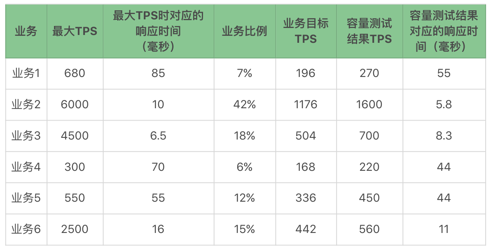
    3）容量性能测试（场景不断、控制比例）
        - 场景不断，就是从低到高线程递增
        - 吞吐量控制器控制比例
        
    4）稳定性性能场景  
    5）异常性能场景
        - 用容量场景中最大 TPS 的 50% 来做异常的压力背景

### 性能分析思路
- 性能分析思路大纲
    - 瓶颈的精准判断
        - TPS 曲线: 有没有瓶颈 & 瓶颈和压力有没有关系
        - 响应时间的曲线: 用来判断业务有多快的
    - 线程递增的策略
        - 如果仅在改变压力策略（其他的条件比如环境、数据、软硬件配置等都不变）的情况下，系统的最大 TPS 上限是固定的
        - 线程递增的过程中出现了抖动，这就明显是系统设置的不合理导致的
            - 资源的动态分配不合理，像后端线程池、内存、缓存等等；
            - 数据没有预热
    - 性能衰减的过程
        - 每线程每秒的 TPS 开始变少，就意味着性能瓶颈已经出现了
        - 在性能不断衰减的过程中，TPS 就会达到上限
    - 响应时间的拆分
        - 链路监控工具来拆分时间
    - 构建分析决策树
        - 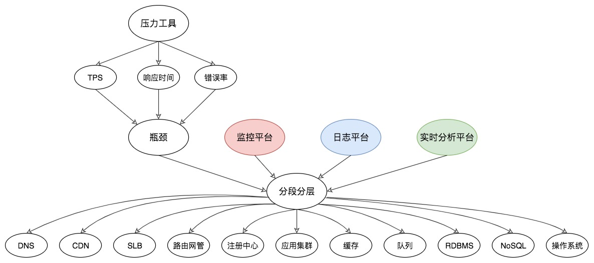
        - 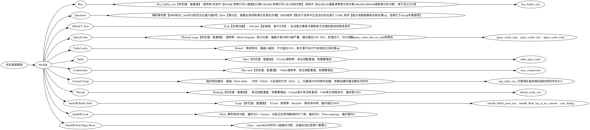
        - 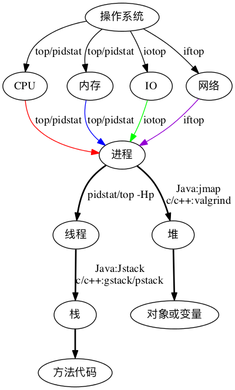
    - 场景的比对
        - 当不知道系统中哪个环节存在性能瓶颈时，对架构并不复杂的系统来说，可以使用这样的手段，来做替换法，以快速定位问题
        
        
#### 测试的场景及工具的选择
-  性能测试的一般过程是：
    - 通过录制、回放定制的脚本，模拟多用户同时访问被测试系统（SUT）来产生负载压力
    - 同时监控并记录各种性能指标
    - 最后生成性能分析结果和报告
    - 从而完成性能测试的基本任
- 测试工具包括的模块
    - 负载生成模块
    - 测试数据收集模块
    - 结果分析和展示
    - 资源监控模块
    - 控制中心模块
    - 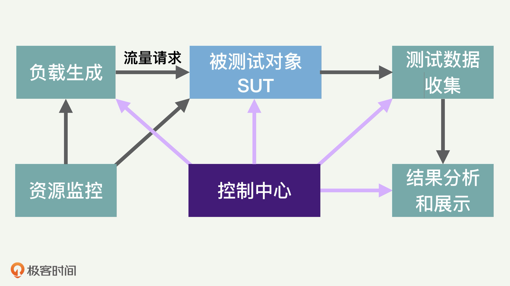
- Web 测试场景
    - JMeter
    - LoadRunner
    - Locust 突出优点是可扩展性很好 
- 系统测试场景
    - UnixBench
    - Perf  
- 数据库测试场景
    - SysBench
    - mysqlslap 
- 文件 IO 和存储测试场景 
    - ioZone 
    - Bonnie++
    - dd
- 网络测试场景
    - Netperf
    - Iperf 
- 移动 App 测试场景
    - 平台生态系统，现在主要有安卓 Android 和 iOS，比如 Appium  
    - adb
    - Monkey 

#### 性能测试监控设置
- 设计步骤
    - 分析系统的架构，对架构中使用的组件进行监控    
    - 要有层次，要有步骤，先全局，后定向定量分析
        - 全局监控
            - OS 层： CPU、I/O、内存、网络的使用率，反应出一个系统的全局健康状态的
                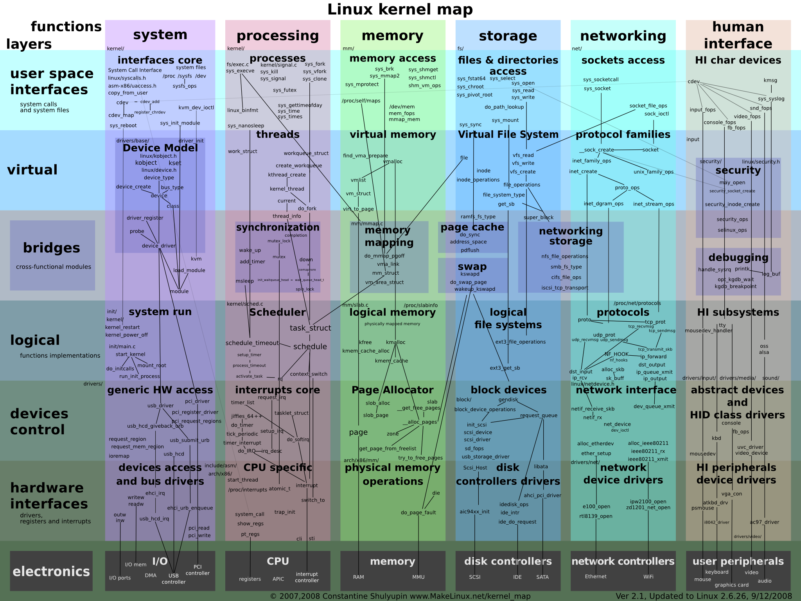
                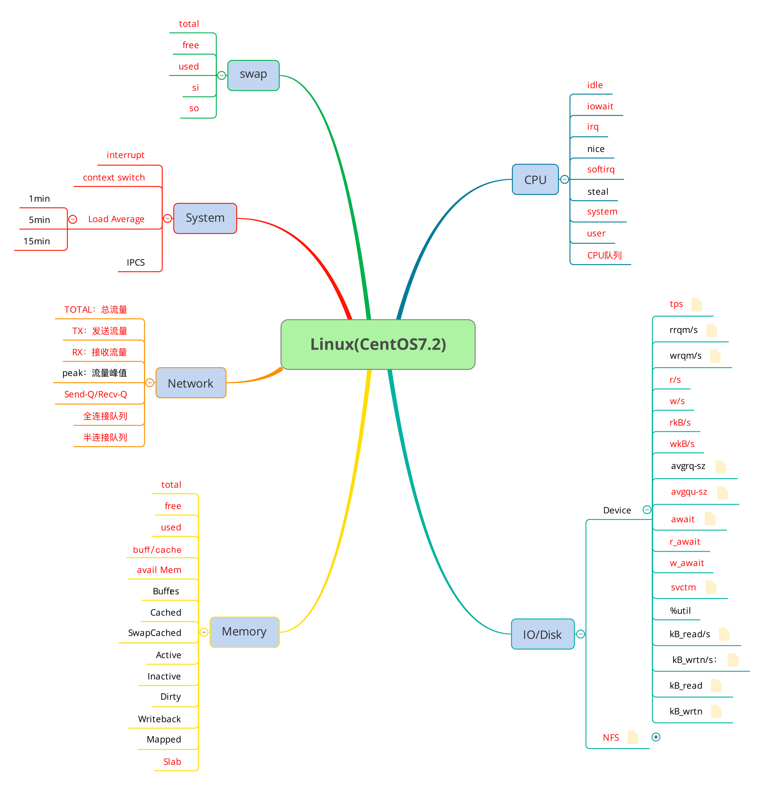
            - DB 层
                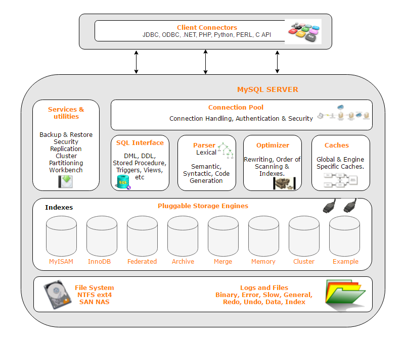
                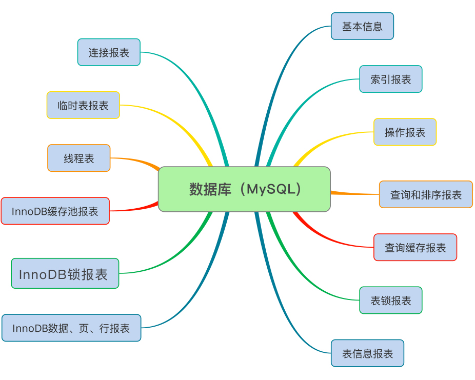
        - 定向监控
            - 好的定向监控就是在实际的性能执行过程中，根据实际的场景画出来
            - 例子： CPU 消耗得多
                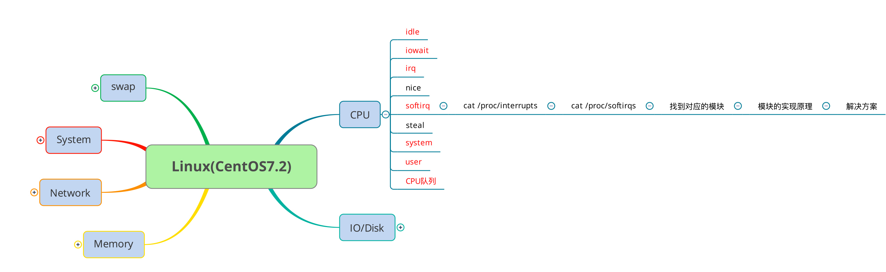
            - Network 中的 Total 总流量比较大    
                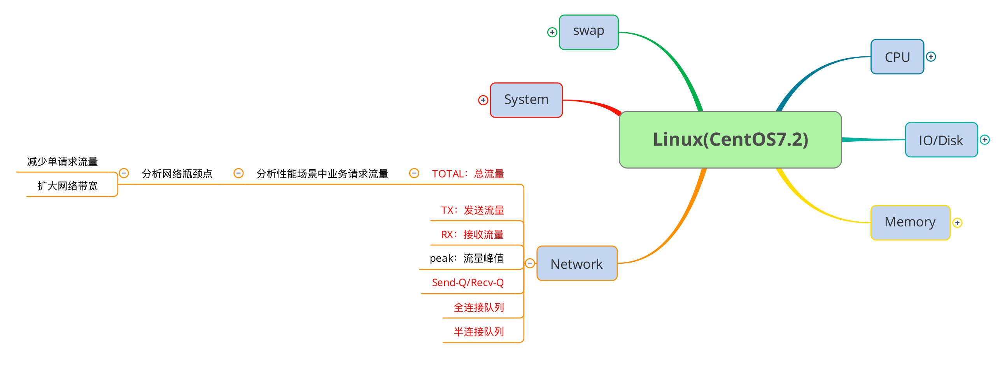       
- 监控技术图谱
    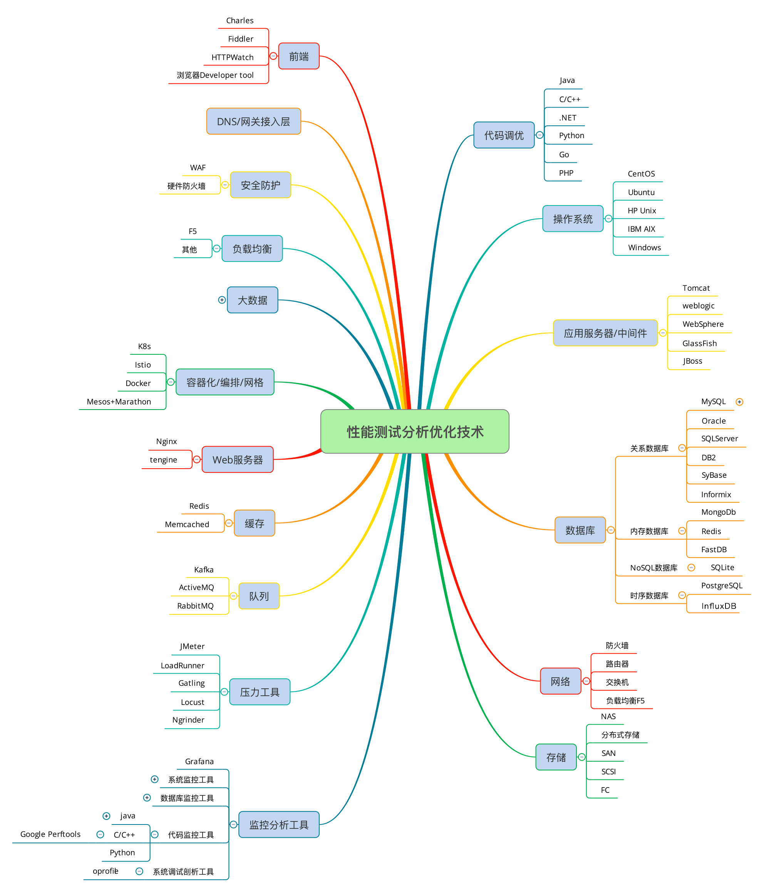
- 监控设计方法
    - 首先对整个架构做分层
    - 在每一个层级上列出要监控的计数器
    - 寻找相应的监控工具，实现对这些计数器的监控    
- 监控工具
    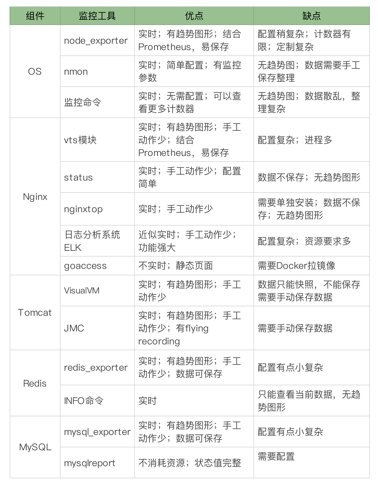
    
        
#### 保证测试结果可靠且可重复的经验和教训
- 测试规划类
    - 详细记录测试环境和测试过程（最好是自动记录），包括操作系统和程序的版本号，以及各种软件参数的设置等
    - 快速地复位测试环境，缓存也清空
    - 足够的负载请求和数据，注意保证它们的多样化和代表性
- 测试进行类
    - 性能数据日志要适当输出，要实时输出有关的性能数据和日志，比如 CPU 使用率数据
    - 测试环境要稳定
    - 一次调一个参数的利弊
- 结果分析
    - 根因分析要由易到难，从最明显的性能瓶颈来开始，往往可以事半功倍
        - 首先从最常见的几种资源和几个指标查起，比如 CPU 使用率、存储 IO 繁忙度、内存大小、网络发送和接收速度等
        - 进一步的分析就可以针对不太明显的资源，比如内存带宽，缓存击中率，线程加锁解锁等
        - 应用程序和系统的一些配置参数
        - 应用业务瓶颈，如 SQL 语句、数据库设计、业务逻辑、算法、数据等
    - 几种测试最好互相验证
    - 测试结果和生产环境比较，尤其要注意的是网络环境的差异 
        - 人为地添加停顿来模拟思考时间模拟真实客户的操作流程
 
 
### 性能指标及监测工具

    
### 性能测试工具
#### ab
#### JMeter
#### LoadRunner