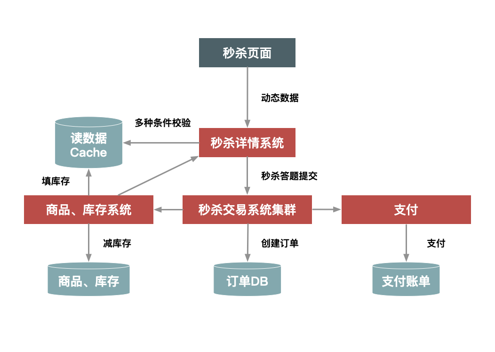
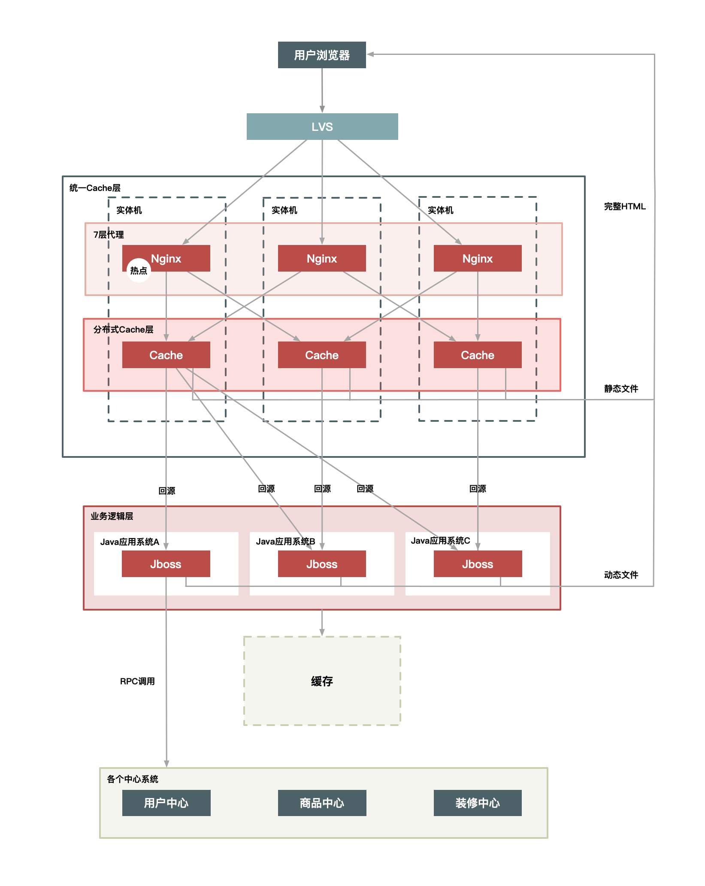
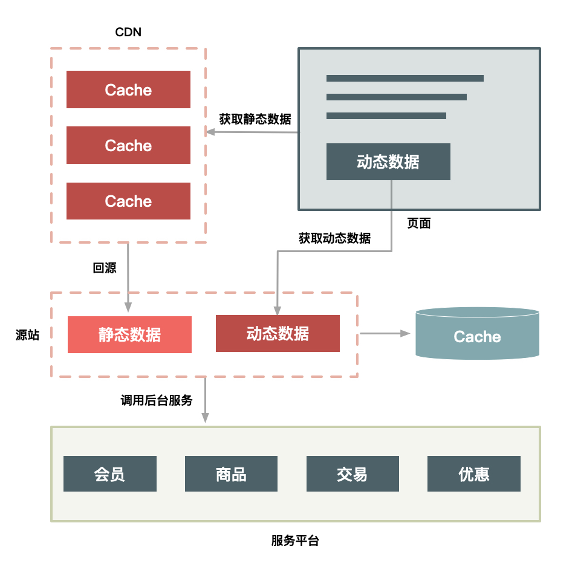

### 秒杀系统
- 本质上就是一个满足大并发、高性能和高可用的分布式系统
- 设计原则(4 要 1 不要”)：
    - 数据要尽量少
    - 请求数要尽量少
        - 前端: 合并css、js文件；图片合并
        - 服务端： 网关合并请求
    - 路径要尽量短： 减少经过的中间的节点数
    - 依赖要尽量少： 
        - 强依赖： 完成一次用户请求必须依赖的系统或者服务
        - 系统分级： 防止重要的系统被不重要的系统拖垮
    - 不要有单点
        - 服务无状态化： 避免将服务的状态和机器绑定

### 秒杀系统架构演进模式
- 简单系统(未做优化，1w/s之下）：
    - 商品购买页面增加一个“定时上架”功能
    - 仅在秒杀开始时才让用户看到购买按钮，当商品的库存卖完了也就结束了
- 初步优化（从 1w/s 到了 10w/s 的量级）： 
    - 独立系统：秒杀系统独立出来单独打造一个系统,单独优化
    - 独立部署：独立做一个机器集群，这样秒杀的大流量就不会影响到正常的商品购买集群的机器负载
    - 读缓存： 热点数据（如库存数据）单独放到一个缓存系统中
    - 增加秒杀答题，防止有秒杀器抢单
    -  
    
- 进一步优化
    - 动静分离：秒杀时，前端只刷新秒杀相关的动态数据
    - 本地缓存：不需要再调用依赖系统的后台服务获取数据
    - 系统保护：增加系统限流保护，防止最坏情况发生
    - 
    
### 设计原则实现方式 
- 动静分离（数据要尽量少）
    - “动态数据”和“静态数据”的主要区别就是看页面中输出的数据是否和 URL、浏览者、时间、地域相关，以及是否含有 Cookie 等私密数据
    - 把静态数据缓存到离用户最近的地方 --> CDN & 服务端Cache
    - 直接缓存 HTTP 响应内容 ： 缓存包括 HTTP 响应头和响应体，节省解析、组装时间
    - 静态文件请求在Web服务器层（Nginx)上缓存处理
    - 技术方案
        - URL 唯一化
        - 仅包含静态数据，动态数据动态/异步获取
            - 浏览者相关数据动态获取
            - 时间数据动态获取
            - 地域数据异步化获取
        - 去除cookie
        - 动态内容的处理
            - ESI（Edge Side Includes）方案
            - CSI（Client Side Include）方案     
    - 动静分离相关的架构选择
        - 实体机单机部署方案
           -          
        - 统一Cache层方案
            - 
        - CDN方案     
            - 

- 热点处理（减少请求量、减少请求的路径）
    - 热点操作： 抽象为“读请求”和“写请求
    - 热点数据： 用户的热点请求对应的数据，分为“静态热点数据”和“动态热点数据”
        - “静态热点数据”，就是能够提前预测的热点数据
        - “动态热点数据”，就是不能被提前预测到的热点数据
    - 热点数据的处理思路：一是优化，二是限制，三是隔离
        - 优化：最有效的办法就是缓存热点数据
        - 限制： 把热点商品限制在一个请求队列里，防止因某些热点商品占用太多的服务器资源，而使其他请求始终得不到服务器的处理资源
        - 隔离，比如秒杀系统中
            - 功能层隔离： 业务隔离
            - 部署时隔离： 系统隔离
            - 存储层隔离： 数据隔离    
- 流量削峰（请求数要尽量少）
    - 本质上来说就是更多地延缓用户请求的发出，以便减少和过滤掉一些无效请求
    - 处理方式
        - 排队： 内存排队、消息队列、文件
        - 答题： 防止部分买家使用秒杀器在参加秒杀时作弊 & 延缓请求
        - 分层过滤: 
            - 将动态请求的读数据缓存（Cache）在 Web 端，过滤掉无效的数据读
            - 对读数据不做强一致性校验，减少因为一致性校验产生瓶颈的问题
            - 对写数据进行基于时间的合理分片，过滤掉过期的失效请求
            - 对写请求做限流保护，将超出系统承载能力的请求过滤掉
            - 对写数据进行强一致性校验，只保留最后有效的数据。

### 秒杀系统关键业务设计 
- 减库存
    - 下单减库存 
        - 好处： 一定不会出现超卖的情况， 
        - 坏处： 有些人下完单可能并不会付款，容易被恶意买家利用
    - 付款减库存 
        - 好处： 不存在占用库存不付款的情况 
        - 坏处： 可能出现买家下单后付不了款的情况，用户体验差
    - 预扣库存 
        - 买家下单后，库存为其保留一定的时间（如 10 分钟），超过这个时间，库存将会自动释放
        - 可以在一定程度上缓解上面的问题
    - 要结合安全和反作弊的措施解决恶意买家问题
        - 给经常下单不付款的买家进行识别打标
        - 给某些类目设置最大购买件数
        - 对重复下单不付款的操作进行次数限制      
    - 秒杀中采用下单减库存性能优化措施
        - 直接设置数据库的字段数据为无符号整数，减后库存字段值小于零时会直接执行 SQL 语句来报错
        - 在缓存中减库存： 适用于减库存逻辑单一的应用（比如： 只有总库存）
        - 数据库存在有大量线程来竞争 InnoDB 行锁的问题
            - 应用层做排队，单个商品在同一个连接里更新库存
            - 数据库层做排队： 给MySQL 的 InnoDB 层上的补丁程序（patch 