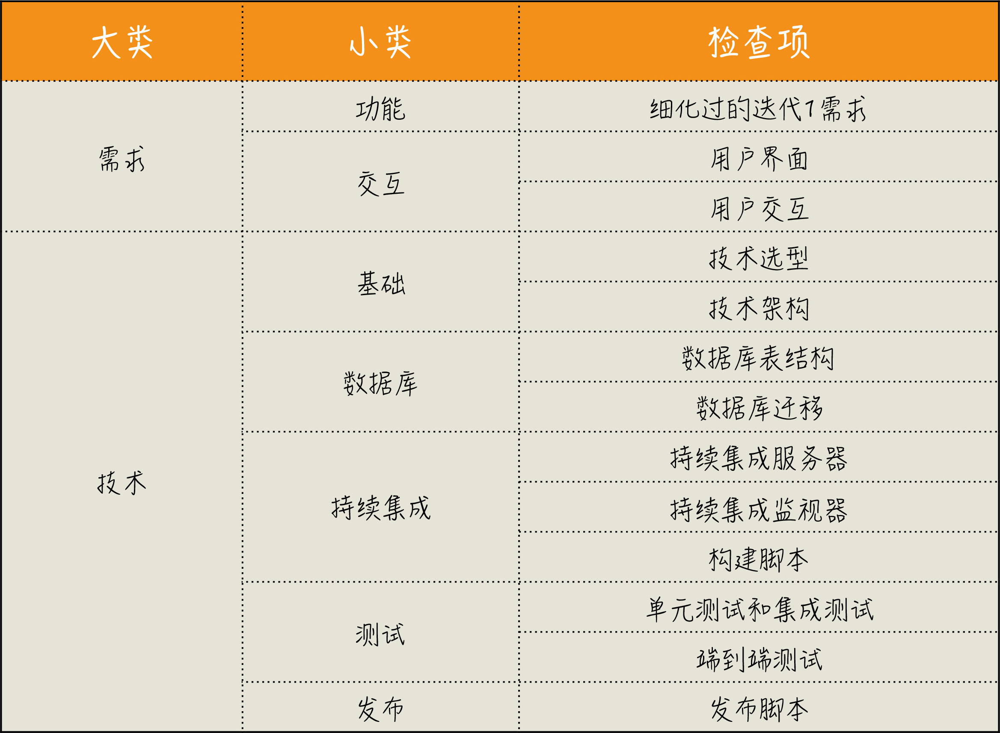

#### 工作低效的原因
- 本质复杂度就是解决一个问题时，无论怎么做都必须要做的事
- 偶然复杂度是因为选用的做事方法不当，而导致要多做的事
- 工作低效是由于工作中偶然复杂度太多造成的

### 思考框架
- 三个问题
    - Where are we?（我们现在在哪？）              现状
    - Where are we going?（我们要到哪儿去？）      目标
    - How can we get there?（我们如何到达那里？）  实现路径
- 思考框架: 为什么要提出问题
    - 目标： 
        - 为什么要做这个特性
    - 目标有效性： 
        - 它会给用户带来怎样的价值？ 
        - 这个特性上线之后，怎么衡量它的有效性？
    - 实现路径： 
        - 什么样的用户会用到这个特性
        - 他们在什么场景下使用，他们又会怎样使用它？
        - 达成这个目的是否有其它手段？是不是一定要开发一个系统？
    
- 思考原则 
    - 以始为终
        - 工作的一开始就确定好自己的目标
        - 不是把别人交代给我们的工作当作目标
    - 任务分解
        - 将大目标拆分成一个一个可行的执行任务
    - 沟通反馈
        - 保证信息能够传达出去，减少因为理解偏差造成的工作疏漏
        - 保证我们能够准确接收外部信息，以免因为自我感觉良好，阻碍了进步
    - 自动化
        - 将繁琐的工作通过自动化的方式交给机器执行
 

### 以始为终
- 遇到事情，倒着想
- 在做事之前，先考虑结果，根据结果来确定要做的事情
- 两次创造
    - 第一次创造 --> 在头脑中的创造 
    - 第二次创造 --> 付诸实践，也就是实际的构建 
    - 第二次创造是一件成本很高的事 
- 把“终”定位成做一个对用户有价值的软件 

#### 最佳实践 --  完成的定义 
- 完成的定义： DoD（Definition of Done)
    - DoD 是一个清单，由一个个的检查项组成的，用来检查我们的工作完成情况 
    - DoD 的检查项应该是实际可检查的
    - DoD 是团队成员间彼此汇报的一种机制 
- 特性开发完成 
    - 开发人员经过了需求澄清、功能设计、编写代码、单元测试 
    - 通过了测试人员的验收，确保代码处于一个可部署的状态 
    - 相关文档已经编写完毕
- 开发完成
    - 开发人员经过了需求澄清、功能设计、编写代码、单元测试 
- https://github.com/dreamhead/moco
- 程序员的交付物并不应该是代码，而是一个可工作的软件 

#### 需求的问题-确定的需求
- 在做任何需求或任务之前，先定好验收标准
- 功能列表的问题
    - 只是一些简单的描述，你并不能看到全局
    - 将一个完整的需求敲成了碎片
    - 补充验收标准也会极大程度地改善双方协作的效率
- 新的需求描述方式： 用户故事（User Story）
    - 关注用户在系统中完成一个动作需要经过怎样的路径
    - 格式： 
        - 标题
        - 概述： 作为一个什么角色，要做什么样的事，以便达成一种怎样的效果
        - 详述： 详细地描述这个用户故事的完整流程
            - 操作流程
            - 用户界面
        - 验收标准（清晰地定义出需求边界）
            - 正常使用流程
            - 异常使用流程
            - BDD（Behavior-Driven Development 行为驱动开发）
            - 业务上的实现细节

#### 需求的问题-不确定的需求
- 默认所有需求都不做，直到弄清楚为什么要做这件事
- 独立思考，多问几个为什么，尽可能减少掉到“坑”里之后再求救的次数
- 软件开发的主流由面向确定性问题，逐渐变成了面向不确定性问题
- 精益创业
    - 解决的是面向不确定性创造新事物
    - 可能少浪费的前提下，面向不确定性创造新事物 
    - 唯一能做的事情就是“试” 
    - 反馈循环 “开发（build）- 测量（measure）- 认知（learn）
    - 好想法继续加强，不靠谱的想法丢掉算了
    - 重要概念： 经过验证的认知
    
    - 最好的办法就是以最低的成本试 MVP（Minimum Viable Product） 
- 问题：
    - 做这个产品特性，你要验证的东西是什么呢
    - 验证的目标是否有数据可以度量
    - 解决问题的重要程度： 是否有更重要的问题需要解决
    - 验证这个目标是否有更简单的解决方案

#### 跳出程序员的角色看问题
- “独善其身”不是好事  
- 不同角色工作上真正的差异是上下文的不同 
- 花大力气去解决一个可能并不是问题的问题，常常是很多程序员的盲区
- 跳出程序员角色思维，扩大自己工作的上下文 
- 单一维度的思考，在多维度思考者的眼里几乎就是漏洞百出的 

#### 做事之前先进行推演
- 结果是重要的，然而通向结果的路径才是更重要的 
- 多数情况下，即便目标清晰，路径却是模糊的 
- 沙盘推演 
- 在动手做一件事之前，先推演一番

#### 用数字衡量
- 问一下自己，我的工作是不是可以用数字衡量
- 所谓的直觉，通常是一种洞见（Insight）
- 洞见很大程度上依赖于在领域长期的沉淀和积累，这其实是大数据
- 当事情复杂到一定程度时，简单地靠感觉是很难让人相信的
- 使用数字衡量结果的例子
    - 基于数字进行技术决策
    - 从数字中发现问题  AIOps 

#### 迭代0 的事务清单
1. 需求方面
    - 细化过的迭代 1 需求
        - 待开发需求列表
        - 根据优先级挑选出迭代1需要开发的功能
        - 需求细化到可执行的程度 
    - 用户界面和用户交互 
        - 用户交互是需求的一部分
2. 技术方面
    - 基本技术准备： 技术选型、技术架构、数据库表设计、持续集成、测试
        - 把测试当作规范确定下来的办法就是把测试覆盖率加入构建脚本
    - 发布准备： 
        - 数据库迁移： 工具flyway
        - 发布

#### 以终为始总结
- 最佳实践
    - DoD，确定好完成的定义，减少团队内部的理解不一致。
    - 用户故事，细化出有价值的需求
    - 持续集成，通过尽早集成，减少改动量，降低集成的难度
    - 精益创业，减少过度开发不确定性产品带来的浪费
    - 迭代 0，在项目开始之前，做好一些基础准备
- 思维转变
    - 两次创造: 
        - 是在头脑中的创造 
        - 付诸实践,实际的构建
    - 在更大的上下文内发现自己的“终”
    - 通过推演，找到通往“终”的路径。
    - 用可度量的“数字”定义自己的“终”
- 实战指南
    - 遇到事情，倒着想
    - 在做任何事之前，先定义完成的标准
    - 在做任何需求或任务之前，先定好验收标准
    - 尽早提交代码去集成
    - 默认所有需求都不做，直到弄清楚为什么要做这件事
    - 扩大自己工作的上下文，别把自己局限在一个“程序员”的角色上
    - 在动手做一件事之前，先推演一番。
    - 问一下自己，我的工作是不是可以用数字衡量。
    - 设计你的迭代 0 清单，给自己的项目做体检。

### 任务拆解
- 一个大问题，我们都很难给出答案，但回答小问题却是我们擅长的
- 难点   给出一个可执行的分解
- 任务分解是一个知难行易的过程  知道怎么分解是困难的 
- 可执行定义： 是否能清楚地知道这个问题该如何解决
- 任务分解是拥抱变化的前提
- 小事反馈周期短，而大事反馈周期长
- 将任务拆小，越小越好 
- 按照完整实现一个需求的顺序去安排分解出来的任务。

#### 测试
- 精益原则的重要思想：内建质量（Build Quality In）
- 冰淇淋蛋卷测试模型

- 行业的最佳实践--测试金字塔

- 越是底层的测试，牵扯到相关内容越少，而高层测试则涉及面更广。
- 从代码是否可测的角度分析 
    - 尽量不写 static 方法 
    - 写代码之前，请先想想怎么测。 
- 测试的坏味道
    - 测试不够简单              简单到一目了然，不需要证明它的正确性
    - 在一个测试里做很多的事情  多写几个测试，每个测试覆盖一种场景
    - 测试没有断言
- 测试的基本结构： 前置准备、执行、断言和清理 
- 好的测试
    - Automatic，自动化
    - Thorough，全面的
    - Repeatable，可重复的
    - Independent，独立的
    - Professional，专业的
 
#### 需求的分解 
- 主题（epic）不能砍的需求
    - 在敏捷开发中，有人称之为主用户故事（master story） 
- 需求分解的原则 粒度越小越好
- 评价用户故事的原则 INVEST 
    - Independent，独立的
    - Negotiable，可协商的
    - Valuable，有价值的
    - Estimatable，可估算的
    - Small，小 
    - Testable，可测试的 
- 用户故事，之所以是故事，就是要讲，要沟通
- 估算的过程也是大家加深对需求理解的过程 

- https://martinfowler.com/articles/feature-toggles.html
- https://www.infoq.cn/article/function-switch-realize-better-continuous-implementations